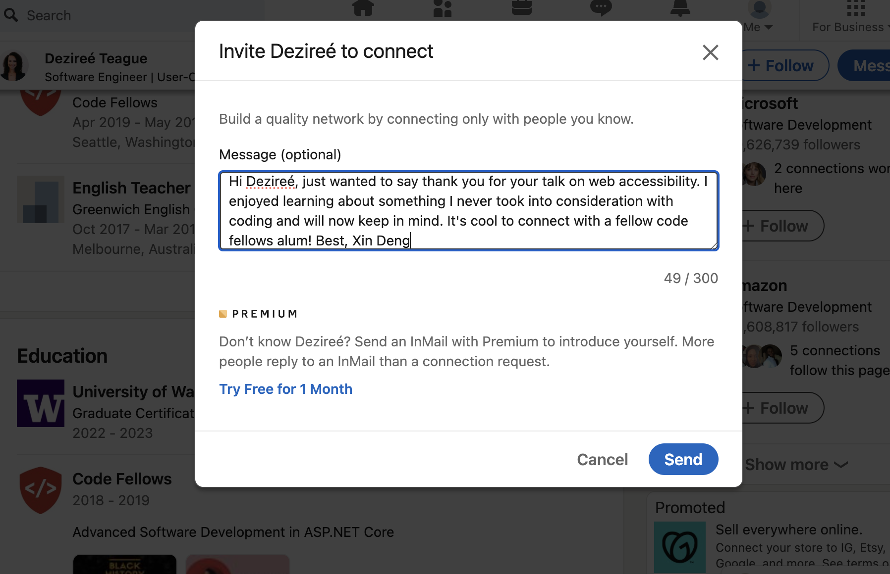

# Class 5 - Images, Color, Text, and More Work with Functions

## Lab 5 - a: Fun with Functions, b: Finish the About Me project, c: CSS Selector Practice

## Setup

### 5a

> You are being given starter code for today, in the index.html and app.js files inside of this directory. The success of your code will be determined by whether it passes tests that are in the tests.js file. You do not need to do anything with tests.js, though you should take a look at it to see how it works.

- Steps to create your repo using the template:

  - Click the green Use this template button

  - Name your repo

  - Click the green Create repository from template button

- Here are a couple of things to keep in mind:

  - Create a new branch for each code problem, and merge each branch into main on GitHub (and then pull back into main on your laptop!) when the problem is completed. Do the problems in order. Don’t forget to pull the updated main branch from GitHub into your local main branch each time you merge a pull request, then make a new branch from main for the next problem.

  - Place no function calls in your code, unless inside of another function. Everything should be run by hand from the console. This is to give you additional practice using the console and practice efficient app-switching processes.

> Submission Instructions

- How did this go, overall?

  - I got stuck on question 3 and it took me forever to figure out I should've used console.log to see what my outputs were after each line because all I was seeing was the red fail on my console. After I realized that writing the rest was easy.

- What observations or questions do you have about what you’ve learned so far?

  - I will need more help on interpreting the english literal and I need to understand the opposite of that first. I'm going to try and find function codes already written and try to interpret that into words to see if it makes more sense for me.

- How long did it take you to complete this assignment? And, before you started, how long did you think it would take you to complete this assignment?
  
  - It took me 2 hours to do this assignment. I thought it was going to take shorter, but it was longer because I couldn't see my own mistakes I was writing out for the variables I was assigning.

### 5b

> Deploy your app to GitHub Pages and add any additional final touches to your CSS. Run a Lighthouse report making sure your site scores between the 50-65 range and add a screenshot of your score to your README.md. Make sure your app is complete and meets all of the requirements from the prior labs. Remove any commented out code or console logs including any commented out console logs that were used in the questionnaire.

### 5c

> Complete all 32 levels of the [CSS Diner](https://flukeout.github.io/) tutorial. Reference [MDN CSS Selectors](https://developer.mozilla.org/en-US/docs/Web/CSS/CSS_Selectors)

1. [CSS Diner Completed Notes](CSS-Diner.md)
2. [CSS Diner Completed Screenshot](img/css-diner-finish.png)

## Written Class Notes

GIT vs GITHUB

- `GIT`: is an application. It has versions, branches, merges, forks, does software version control (VCS)
- `GITHUB`: is a website that uses git, makes git easier to use
- `GH in CLI` = specific for github in terminal

Branches:

- Repo: `Aboutme`
- `Branches`: main (default), whatever is in here usually is good to go live, final version
  - Add button branch: creates parallel work, if you ACP it won't merge with main, but added another commit to the parallel work space. You need to PR and merge with main for button branch to show up on main
- `Creating a branch`: `git checkout -b branchName` when ACP its `git push origin newBranchName`
  - still need to PR and merge
  - usually you delete branches but keep it for this class for easy grading
  - then in terminal move back to main branch `git checkout main`
  - `git pull origin main` to bring those merge changes in
  - What if you write content but realized it needs to be in a branch
    - do `git checkout -b newBranchName`, and sends the modified changes to that branch, can only be done before a commit

CSS Practice:

- `Block Elements` by default will go full width of page and stack vertical (div, section, footers,ul, li are block)
  - give smaller size to make go side by side
- `Inline Element` takes up space it needs, goes side by side, slams together
  - `Inline-block`: displays inline, side by side, disobeys block element
- `Absolute positioning`: the element is positioned to the nearest parent element, it moves with the content when the user scrolls, moves out of original layout
- `Relative positioning`: element still occupies space in the page, but it's just positioned a bit differently. Other elements on the webpage aren't affected; they stay in their original layout.

               HTML
               

                     

                        
first-child

                        
last-child

                     

                     <ul>
                        <li>
                           Foobar
                           Foobar
                           Foobar
                           Foobar
                           Foobar
                           Foobar
                        </li>
                     </ul>
               

            CSS
            body {
               background: #ccc
            }
         div.grandparent {
            border: 1px solid black
            height 500 px
            position: relative
         }
         div.parent {
            border: 1px solid red
            height 350px `(if no height, it collapses if child has float so add height or add overflow:hidden)`
            position: relative
         }

         div.child{
            border: 1px solid blue
            display: inline-block `(can get rid of this and add float:left so no margin that comes with inline-block)`
            height 100px
            width 100px
            position: absolute `(absolute only works if parents have a position or If the element doesn't have any positioned ancestors, it uses the document (or the viewport) as the reference point.)`
            bottom: 0px
            right: 0px
         }

         div.child:first-child{
            position: absolute
            bottom: 0px `(bottom and left go in play only if positioning is placed)`
            left: 0px
         }
         div.child:last-child{
            position: absolute
            bottom: 0px
            right: 0px
         }
         footer {
            background 222
            height 100px
            width 100%
            position: fixed
            bottom 0px
            left 0px
         }

JS Rules - Omitting`{}` and `;` are legit JS code but shouldn't be optional

      Lab 5a steps:
      Make a repo from the template
      Clone it
      Create a branch called question-1
      Do teh work for question 1
      ACP to question-1 branch
      Go to github make a PR
      Approve and Merge the PR
      On. your machine, switch back to main
      Pull main
      Create a new branch called question-2
      ... rinse and repeat

### Describe and Define

- Image formats (JPG, GIF, PNG) and the strengths/weaknesses of each format.
- The importance of GitHub and branches.

### Answer

1. The `` tag has what 2 required attributes?

2. What is the difference between Serif and Sans-serif fonts?

3. What is the purpose of branching?

4. Fill in the blank: To create a new branch in the terminal, use `git checkout ____ <branch name>`.

5. What is a PR or pull request?

## Read - Images, Color, Text

## Resources Link/Pages

### HTML Media

1. [HTML Media](https://developer.mozilla.org/en-US/docs/Learn/HTML/Multimedia_and_embedding)
2. [Using Images in HTML](https://developer.mozilla.org/en-US/docs/Learn/HTML/Multimedia_and_embedding/Images_in_HTML)
3. [Common Image Types](https://developer.mozilla.org/en-US/docs/Web/Media/Formats/Image_types)
4. [Choosing Image Formats](https://developer.mozilla.org/en-US/docs/Web/Media/Formats/Image_types#choosing_an_image_format)

### Learn CSS

1. [Learn CSS](https://developer.mozilla.org/en-US/docs/Learn/CSS)
2. [Using Color in CSS](https://developer.mozilla.org/en-US/docs/Web/CSS/CSS_Colors/Applying_color)
3. [Styling HTML Text Elements](https://developer.mozilla.org/en-US/docs/Learn/CSS/Styling_text/Fundamentals)

## Answer

Statement on why this topic matter as it relates to what I'm studying in this module:

- Knowing how images work in HTML is important because it adds to the visual look of a webpage and it can show information better than what is written or even enhance what is written. Understanding how to use colors helps in creating a more unified design of a webpage which can improve accessibility.

### HTML Media

1. What is a real world use case for the `alt` attribute being used in a website?

   - You can use to provide a simple text description of a picture. It is accessibility friendly because for people who need a screen reader, they can hear a description of the image.

2. How can you improve accessibility of images in an HTML document?

   - Use the `alt` attribute for every image and including a concise and accurate description of what the image is.
   - If the image is important try to add more details in the body of text
   - If the image is for decoration add an empty `alt` so that a screen reader doesn't waste time on it.

3. Provide an example of when the `figure` element would be useful in an HTML document.

   - The `figure` element is a semantic container for figures and its caption. Captions are useful for even people who can see an image, but `alt` is useful for people who can't see, so they shouldn't say the same thing.
   - `Figure`element is useful when you want to group content with a caption. You can use it for tables, images, videos, audios anything you would like an additional description to go along with it.

4. Describe the difference between a `gif` image and an `svg` image, pretend you are explaining to an elder in your community.

   - GIFs are a type of image that move like a flip book or a mini video is playing inside an image. They are good for short loops of animation and are small in size, so the quality is lower vs SVG whose quality doesn't diminish when you change the size. Instead of animations, SVGS are often used for things like logos where it's important quality isn't lost when changing it.
   - `GIF`: Graphics Interchcange Format, ideal for simple images and animation
     
   - `SVG`: Scalable Vector Graphics, ideal for user interface elements like diagrams, icons, need to be drawn accurately in all sizes.

5. What image type would you use to display a screenshot on your website and why?
   - Depending on what the image is and if a loss in quality isn't important, JPEG and PNG can be used, but PNG is the better option if the screenshot has important text since text can be unclear when compressed under JPEG
   - `JPEG`: joint photographic experts group, good for compression of still images
   - `PNG`: portable network graphics, PNG preferred over JPEG for better copy of course image.

### Learn CSS

1. Describe the difference between foreground and background colors of an HTML element, pretend you are talking to someone with no technical knowledge.

   - If you understand the word foreground and background, it is pretty self-explanatory. If you ever written a word document or read a book. Foreground color would be the whatever color ink the text of a book is written and the foreground would be the page color.

2. Your friend asks you to give his colorless blog website a touch up. How would you use color to give his blog some character?

   - I would start with a background color and select any color besides solid white or black since it can strain people's eyes. Whatever background color is chosen, I would use a color palette picker and work with colors that best match the background. I like lighter colors of bright colors so a lighter orange or pastel yellows. Foreground colors need to be darker if you're choosing a lighter background. Black is my default for paragraph texts and for things like headings, I like darker shades of fun colors that can still contrast against the lighter background.

3. What should you consider when choosing fonts for an HTML document?

   - It depends on what the content is and also how easy it is to read it. Fonts should be clear and legible. For body texts select a professional looking font vs really funky ones. Try not to use heavily colored fonts for texts that are important.For headers or titles consider the font size to highlight importance.

4. What do `font-size`, `font-weight`, and `font-style` do to HTML text elements?

   - `font-size`: changes the size of the text
   - `font-weight`: changes the boldness or thickness of the text
   - `font-style`: changes the italics of text

5. Describe two ways you could add spacing around the characters displayed in an `h1` element.

   - `letter-spacing`: changes the horizontal spread between characters. It causes characters to spread apart when positive value or brings letters closer when negative value.
   - `word-spacing`: changes the space between words and similar to `letter-spacing` words spread apart when positive value and come closer together when negative.

## Things I want to know more about

- I find that when I use a color picker, the colors I choose might not be pleasing to others. Is there a universal color scheme that equates to better accessability?

## Career 5 - Partner Power Hour: Report 1

> If there is no live presentation on campus in this module, select the appropriate presentation from the list below. All presenters are open to connections and invite you to reach out to them, so that you can to learn more about them, their company, and the industry.

[Web Accessibility 101 - Dezireé Teague](https://www.youtube.com/watch?v=JW0K87kaDng)

[CSS 101: Transitions & Animations - Brian Nations](https://www.youtube.com/watch?v=sqc-5AFKwxM)

[Dealing with Workplace Ambiguity - Amanda Iverson](https://www.youtube.com/watch?v=mndjhcnChGI)

`Web Accessibility 101 - Dezireé Teague`

1. Share one or two ways the speaker’s information will change your approach to your career transition.

   - She gave a good advice near the end of her talk and mentioned that especially for someone just starting out, go for a company that matches something you're interested in or related to your background and then if you can contact then and if they're not hiring, ask for a position they don't have on their site.
   - When we think about user stories in the future tried to think about one person who has a disability and that will change how you design and structure your website.

2. List a few key take-aways from this presentation.

   - The benefits of making webpages accessible:
     - improves the user experience for everyone
     - avoid legal issues
     - reach wider audiences
     - economic gain
   - Identify any transferable kills that make you resourceful and adaptable
   - ADA title three said no discrimination against someone with a disability in any place of public use and the web is public

3. Share a screenshot of your LinkedIn connection request, including a nicely worded note, sent to the speaker or someone else at their company.

## Instructor 1-on-1 Meeting Reflection

- What are your goals while taking this course?

  - I just want to be a bit more confident at the basics of HTML, CSS, and JS and be able to make a webpage without looking at my notes.

- Are there any areas of concern, questions about the course or adjustments we might consider?

  - The in-class-demos are done all over the place, so there are different sources and links. It would be helpful if you could copy all those notes and demos into the files you always push into the 201 demo folder on GH. And also when you do coding demos sometimes you write a code to explain a concept and then rewrite that code to explain a different concept, would be helpful to copy that original code and edit that one for new concepts instead of erasing the original one that way your demonstration for previous concepts are still written down somewhere. 
  - I felt confused this entire past week in lectures because you jump all over the place it feels like the concepts or ideas are harder to learn because it feels very scattered and I have to start after lunch some times self teaching myself or get others to explain in remo. But I don't know if it's just your teaching style and I haven't adjusted yet. 
  - There seems to be some miscommunication between instructors and TAs. For example: when we created the about me repo, originally I think most of us followed your demo and named it Class 2 lab, and during remo that day when we asked the TAs to confirm if our files and files structures were correct they told my table yes.
  - Is it possible to get a full hour lunch? Or do we always start back up at 1 pm?
  - You probably can't do anything about it, but class feels really disruptive some times because of one person. They are very argumentative with you sometimes and interrupts you when you're trying to answer their question.

- What professional proficiency would you consider to be your top strength?

  - Under the Results Competency I think my top strength is dependability and reliability. I can be held accountable for choices made and I produce decent work and don't turn assignments in late.

- What areas of professional competency would you like to improve?
  - Under the leadership competency I think I need to improve on networking and confidence. I've always been bad at it, especially when it comes to connecting for jobs. My social anxiety flairs.

## Learning Journal

Write a brief reflection on your learning today, or use the prompt below to get started.

> “Adults need to know why to learn something; as soon as they answer this question, they are ready to start.”

The **why** applies to both large-scale (learning web development as a new profession) and small-scale (learning a particular tool or technique), and your learning journal is an excellent place to identify and contemplate those **whys**. They are important. So… what is your **why**?

- I think my why is personal growth. Yes I want money, but I want what follows that, which is a stable future that includes growth in many aspect of my life as I age. While super hard and stressful right now, when I do understand a concept, I have started to become excited about it. I see gaining these new understanding of tools, techniques, and web development overall is giving me a sense of accomplishment and a little bit of confidence.
