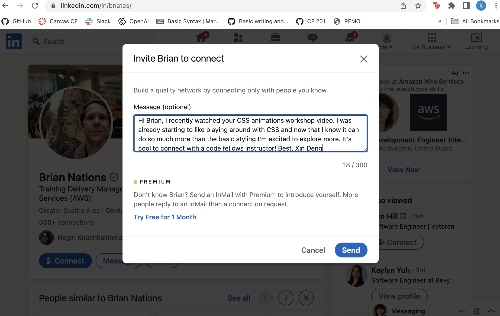

# Class 10 - Debugging and Error Handling

## Lab 10 - a: Build a Single Webpage in 4 hours, b: Salmon Cookies Pt. 5

## Setup

### 10a

> In lab today you will be building a single webpage based off of the provided design comp assets. This assignment is a lot of HTML and CSS, and not as much JS as we’ve been doing this week. In fact, you may choose to do this project with no JS at all, or just add some as a finishing touch. You only have 4 hours to complete this assignment. It is your job to create a page that looks exactly like the preview below. Within your GitHub class repo, under today’s directory, you will find all of the assets required to accomplish this task in addition to a larger version of this preview image.

1. Create a new repository for today called **chocolate-pizza**. If partnered for this lab, follow the pair programming work flow by having one user fork the other so that you can get some practice in your Git processes. Be sure to do frequent commits, and always do your work on branches. Before starting coding, think about a strategy for approaching this project. Before writing code, think about a practical order in which to do the work:
    - When should you focus on styling?

    - When should you make a decision about a layout scheme?

    - When should you just build out the structure of the HTML?

    - When you should you add JS? Do you even add JS?

2. Suggestion: Set up your work directory like this:

    - `index.html`

    - `style.css`

    - `app.js or script.js` (if you choose to use JS)

    - `img/` (a directory that contains all of your image assets)

### 10b

> Finish up your Salmon Cookies project. Ensure that you meet all minimum functionality described in prior labs as well as successfully implemented all of the requirements for the `index.html` file listed in Lab 06. Here they are, listed below:

  1. A custom Google font for highlights

  2. A specified standard sans-serif web font for data (such as Arial, Verdana, or Helvetica)

  3. A specified standard serif web font for text (such as Georgia, Times, etc.)

  4. Specified different font colors for all three font usages

  5. A background color for the default page background (make sure font colors have good contrast and are readable on this background)

  6. A different background color for elements such boxes and tables (so make sure the font colors contrast against this well, too!)

  7. Anything else you’d like to add related to style. But remember: simplicity, clarity, and consistency are good things in design.

  8. Be thoughtful about layout and overall organization of the page.

  9. Run a Lighthouse Accessibility report looking for a score between 65-80. Make adjustments to site as needed to get to that score. Add a screenshot of your score to your README.md.

  10. Include all of the typical stuff that you’ll find on the home page of a business: locations, hours, phone number, email address, some text about how awesome the business is, etc. Be creative, and again, think about what is meaningful to a typical end user.

## Written Class Notes

### Describe and Define

- Response design principles
- Software execution call stack
- JavaScript debugging tools and methodologies

### Notes

1. What are a few ways we can debug our code?

2. What are some of the error types you may encounter in the console?

### Major Browsers' Debugging Tools

**Keyboard**: macOS: `command` + `option` + `i`
**Chrome**: menu, more tools, developer tools, console
**Safari**: preferences, main menu, enable show develop menu in menu bar, in develop menu click show web inspector

## Read 10 - Debugging

Bookmark and Review: [Debugging HTML](https://developer.mozilla.org/en-US/docs/Learn/HTML/Introduction_to_HTML/Debugging_HTML) and [Debugging CSS](https://developer.mozilla.org/en-US/docs/Learn/CSS/Building_blocks/Debugging_CSS)

## Resources Link/Pages

### What Went Wrong? Troubleshooting JavaScript

1. [What Went Wrong? Troubleshooting JavaScript](https://developer.mozilla.org/en-US/docs/Learn/JavaScript/First_steps/What_went_wrong)

### The JavaScript Debugger

1. [The JavaScript Debugger](https://developer.mozilla.org/en-US/docs/Learn/Common_questions/What_are_browser_developer_tools#the_javascript_debugger)

## Answer

Statement on why this topic matter as it relates to what I'm studying in this module:

- Bugs or errors in your code are inevitable and knowing how to troubleshoot or use the debugger helps developers identify and fix code efficiently. Efficient debugging also leads to better quality of code and optimize a better performance of a webpage. 

### What Went Wrong? Troubleshooting JavaScript

1. Name some key differences between a **Syntax Error** and a **Logic Error**.

  - `syntax error`: these are errors in the structure of the code. They are usually wrong punctuation or grammar rules. These prevent the code from running at all. 
  - `logic error`: these are errors in the logic of the code. They still run but do not produce the expected output. 

2. List a few types of errors that you have encountered in past lab assignments and explain how you were able to correct them.

  - I've gotten a few like blank is undefined. It occurs when I didn't understand the logic of the code and did not declare the variable. I've corrected them by using console.log and checking that variable names match. 
  - I've gotten syntax errors where brackets are missing and I couldn't find where they were missing. I had to input my code into gpt and asked why my code isn't working and it would show me where the missing brackets were. 
  - In the beginning I always had syntax errors where I was missing the `;` after each line of code and it wouldn't run. Again, gpt was great in helping me locate the errors.

3. How will this topic continue to influence your long term goals?

- It gives me the opportunity to enhance my problem solving skills and knowing how to debug code is valuable for all projects in helping fix errors. And being able to solve issues can help with my confidence in coding. 

### The JavaScript Debugger

1. How would you describe the JavaScript Debugger tool and how it works to someone just starting out in software development?

  - It helps you examine your JS code by allowing you to pause your code from executing at certain points so you are able to look at the variables, functions, and understand the flow of the code. 

2. Define what a breakpoint is.

  - It is the point in the code where you tell the debugger to stop at to stop the execution of the code. At the breakpoint is where you can look at the code closer and help you understand how it runs at specific points, allowing you to find and fix bugs more effectively. 

3. What is the call stack?

  - It is the section that shows you the code that was already executed to get to the current line of code you are in. It keeps track of functions that are running and when you set `breakpoints`, the call stack can show you the process of how your program has performed at that point. 

## Things I want to know more about

- Is there one specific place where you can debug all three HTML, CSS, and JS. I see in the console that it is helpful for CSS, but can you use that for JS and HTML too? 

## Career 10 - Partner Power Hour: Report 2

> If there is no live presentation on campus in this module, select the appropriate presentation from the list below. All presenters are open to connections and invite you to reach out to them, so that you can to learn more about them, their company, and the industry.

[Web Accessibility 101 - Dezireé Teague](https://www.youtube.com/watch?v=JW0K87kaDng)

[CSS 101: Transitions & Animations - Brian Nations](https://www.youtube.com/watch?v=sqc-5AFKwxM)

[Dealing with Workplace Ambiguity - Amanda Iverson](https://www.youtube.com/watch?v=mndjhcnChGI)

`CSS 101: Transitions & Animations - Brian Nations`

1. Share one or two ways the speaker’s information will change your approach to your career transition.

  - There wasn't really anything because it was a workshop for CSS animations, but he did say at the end to conform to company style and keep animations as simple as possible, which are both good tips to keep in mind. It's kind of like the whole following the company's vision or goals competency. 

2. List a few key take-aways from this presentation.

  - Check out the website codepen. It's good for practicing CSS
  - Sometimes simple animations can be done in CSS because CSS is already loaded in but JS can be slow because it still has to run
  - CSS3 allows animation in CSS without JS

3. Share a screenshot of your LinkedIn connection request, including a nicely worded note, sent to the speaker or someone else at their company.

## Learning Journal 

Write a brief reflection on your learning today, or use the prompt below to get started.

Read this [short article](https://asana.com/resources/impostor-syndrome) on Imposter Syndrome. On a scale from 1 (least) to 10 (most), to what extent do you experience these feelings? Have you always felt the way you do now? If you have successfully lowered the number you’d use to rate your Imposter Syndrome, how have you done so?

- Right now I am at a 1. I haven't experienced this often and I think I've always felt this way. I think the reason it is low is because I celebrate the wins and don't focus on the failures a lot. I also kind of recognize, for example in jobs, like this is just a job, I really do not need to be doing so much and just do my own responsibilities. There is no need to be a perfectionist or overachiever if you're not compensated for it. 