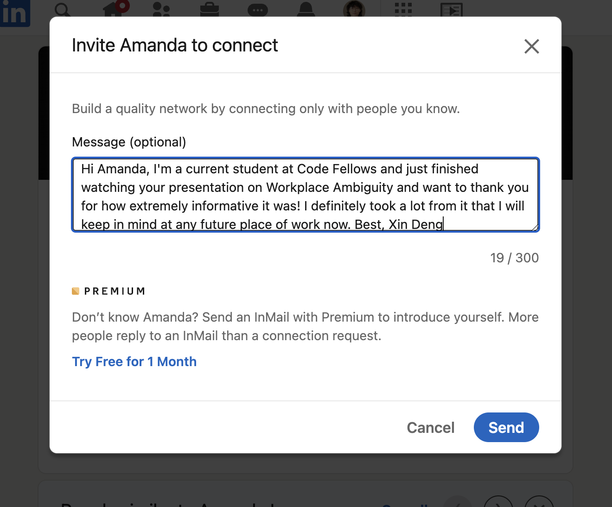

# Class 15 - Course Recap and 301 Preview

## Lab 15 - a: Merge Conflicts b: Odd Duck Pt.4

## Setup

### 15a 

Read the document, in its entirety, before beginning your lab. To view this lab assignment in its own tab, click [HERE](https://codefellows.github.io/code-201-guide/curriculum/class-15/lab-a/)

    Problem Domain: 
    Merge conflicts occur when files get out of sync between GitHub and a user’s local code base, and Git becomes unsure of where `HEAD` really is.

    Let’s describe and experience how a pretend team would get into that situation and then extricate themselves from it.

1. One team member should create a repository within GitHub called `mc-exercise` and add all other teammates as collaborators (in the ‘Settings’ tab, look for ‘Collaborators’ in the nav on the left of the screen.)

2. Assign a member of your team to each character, and then do what they do. And do ONLY what they do.

3. Our sample team has four members: Bob, Carol, Ted, and Alice. Add a file called `FUBAR.md` to the `main` branch of the repo. When we start, everyone is totally in sync and freshly pulled from `main` on their individual laptops, and has `FUBAR.md`. Bob and Carol are pair-programming one feature in `FUBAR.md`on Carol’s laptop in a new feature branch, and Ted and Alice are working on another feature in a different non-main feature branch on Ted’s laptop, also in `FUBAR.md`.

4. Do this exercise four times, following the steps below: once with each team member in each role.

5. For the purposes of this exercise, the work you’re doing on a feature, always in `FUBAR.md`, consists of adding a sentence or two of “This is what Bob & Carol did on Bob’s computer when working on the first feature” and maybe a joke or something to keep your teammates amused.
6. In the meantime…
    - Bob & Carol have switched to Bob’s laptop, started a new feature branch in FUBAR.md, and started working on it. They did not do a git pull origin main and will live to regret it.
    - They finish that feature at the same time that Ted & Alice finish their feature.
    - Each team does an A-C-P and makes a PR.
    - They review each other’s PRs and attempt to merge them.

7. Merge Conflicts…
    - To sort out a merge conflict, check all of your project files for the markers that indicate merge conflicts, the >>>>>>>>> and HEAD lines of code. Edit the code to remove the redundancies causing the merge conflict, and eliminate the markers.
    - Get everyone’s individual laptop back in sync by doing a git pull origin main into main until Git stops no longer sees any conflicts.
    - Then they switch partners, of course. Bob & Alice start a quick new feature on her laptop in the main branch and Ted & Carol start another new feature of their own, also in main.
    - They finish these quick features, and attempt to A-C-P and create/merge PRs.

8. Resolve any merge conflicts in the same manner as above if there are any pending.

9. How could these problems have been prevented?

10. Review the workflow on Bob & Carol & Ted & Alice and try to identify all of the individual things that they did wrong AND all of the things that they should have done but failed to do. Write up descriptions of those things and put those into the README of the repo.

### 15b

> Finish up your Odd Duck Products application.

1. In addition to all prior lab assignments, ensure the following are also completed:
    - Add any final touches to your CSS
    - Run a Lighthouse Accessability report. Make necessary updates to your application based on the report to get your score above 80.
    - Fix any bugs that are present in your code
    - Document your code with comments
    - Update your readme with an overview of your application
    - Deploy your application to GitHub pages

## Written Class Notes

None. Veteran's Day

## Read 15 - No Readings for Last Lecture Day

## Career 15 - Partner Power Hour: Report 3

> If there is no live presentation on campus in this module, select the appropriate presentation from the list below. All presenters are open to connections and invite you to reach out to them, so that you can to learn more about them, their company, and the industry.

[Web Accessibility 101 - Dezireé Teague](https://www.youtube.com/watch?v=JW0K87kaDng)

[CSS 101: Transitions & Animations - Brian Nations](https://www.youtube.com/watch?v=sqc-5AFKwxM)

[Dealing with Workplace Ambiguity - Amanda Iverson](https://www.youtube.com/watch?v=mndjhcnChGI)

> Dealing with Workplace Ambiguity - Amanda Iverson

1. Share one or two ways the speaker’s information will change your approach to your career transition.
    - You should just accept ambiguity is going to happen. You and your team just need to learn to navigate it and build up a tolerance to it. I should be comfortable with make decisions that may not be correct and know it's ok to fail. And always communication, state my assumptions out loud. Stay cool, good decisions don't come from a place of stress.

2. List a few key take-aways from this presentation.
    - The causes for ambiguity are:
      - Lack of communication
      - Undefined problem domain
      - Unclear goal

    - Where to expect ambiguity:
      - When starting a new project
        - do user stories in sprints
        - make a system requirement specs document
        - gather requirement from a client 
      - Collaborating with your team
          - Troubleshooting
          - Submitting requests
      - Asking questions 

    - Consequences of ambiguity
      - Low productivity
      - Wasted time/effort
    - Creating the wrong thing
      - Inaccurate estimates 
      - Missed deadlines 

    - What can you do:
      - Daily standups - talk to each other
      - Documentation - clarifying in writing , creates shared understanding
      - Clarify requirements, give example scenarios, reword it, ask open ended questions, start a discussion
      - Have a QA- confirm functionality 
      - Show the client demos and get feedback

3. Share a screenshot of your LinkedIn connection request, including a nicely worded note, sent to the speaker or someone else at their company.

## Learning Journal - No Journal for Last Lecture Day