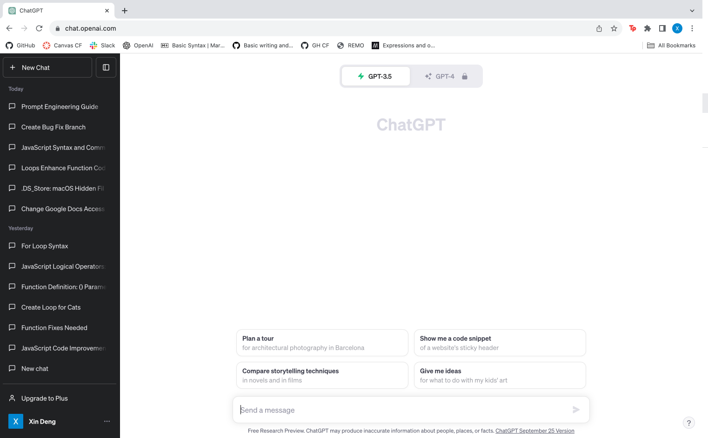

# AI and Prompt Engineering

## Read the following pages from this [Prompt Engineering Guide](https://www.promptingguide.ai/){:target="\_blank"}

1. [Introduction](https://www.promptingguide.ai/introduction){:target="\_blank"}
   - Prompt engineering developes prompts to maximize AI
2. [Basics of Prompting](https://www.promptingguide.ai/introduction/basics){:target="\_blank"}
   - Prompts can be instructions/questions
   - Question answering (QA) format: `<Question>? <Answer>`
3. [Prompt Elements](https://www.promptingguide.ai/introduction/elements){:target="\_blank"}
   - Don't need all four elements, depends on what
     - **Instruction**
     - **Context**: extra info to get better response
     - **Input Data**: what we need response for
     - **Output Indicator**: type of output
4. [General Tips for Designing Prompts](https://www.promptingguide.ai/introduction/tips){:target="\_blank"}
   - Start simple, use clear commands or use clear separator like `###`

You could also use [Awesome ChatGPT prompts](https://prompts.chat/){:target="\_blank"} to help you have fun using chatbots!

## Assignment

1. Confirm you have an active chatbot account
   - 
2. Ask your chatbot to explain a topic or something related to your previous work experience and see how accurate it is.
   - Tried 5 prompts before it gave me something accurate. I asked: Explain the typical responsibilities of a lead receptionist managing a team at a no appointment walk-in only veterinary clinic in one paragraph.
   - ChatGpt Output: A lead receptionist managing a team at a no-appointment, walk-in-only veterinary clinic holds a pivotal role in ensuring the clinic's smooth operation. Their responsibilities encompass overseeing the reception area, managing a team of receptionists, and maintaining a welcoming environment for pet owners. They coordinate client flow, handle walk-in appointments, and manage the administrative aspects of the clinic, such as maintaining patient records and ensuring accurate billing. Additionally, they supervise staff schedules, provide guidance to receptionists, and collaborate closely with the veterinary team to facilitate efficient care. Exceptional organizational and communication skills are essential, enabling them to handle a high volume of clients and ensure seamless collaboration between the reception team and the clinic's practitioners.

## Submission Instructions

Create a markdown file titled `prompt-engineering.md` in your reading notes repo and share the output from your chatbot. Submit the link to this created file.
