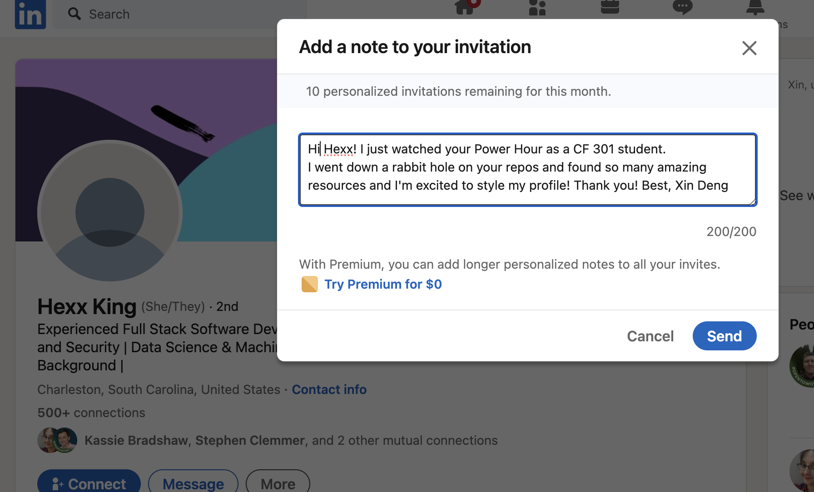

# Class 5 - Putting it all together

## Lab 5 - Deploy and Extend Your Portfolio

## Setup

I thought i understood but i think i confused myself now   so The two types of data flow option you wrote earlier User
sending data to component and they can fetch their data vs do it all in app state and pass functions to the children, in your cityforms where you have useState is that an example of the components fetching data and for all other files where useState is in App that's the whole passing functions down to children? I' think im having trouble recognizing or differentiating what exactly those two data flows look like can you show an example of what those differences look like

Get ready to take a look at a full-featured code base! You have just started a new job and the employer wants you to demonstrate your skills by building a portfolio using React. This should highlight your knowledge of the React library and your ability to explore a new codebase. The [starter template](https://www.npmjs.com/package/cra-template-react-portfolio) for this class contains a complete React + Bootstrap site with example pages, icons, styles, and a themed layouts. Your job is to customize this code by following the specifications in the Trello board.

You will be deploying your React portfolio to [Netlify](https://www.netlify.com/).

**Workflow**

- We will be using the [Trello project management tool](https://trello.com/home) for this lab.

- To maximize your experience with Trello, you should create a free Trello account by clicking on the Sign Up button.

- After creating an account, open the [React Portfolio Board](https://trello.com/b/BEvm5LDn/react-portfolio), open the “… Show Menu” link, click the “… More” link, and then click “Copy Board”. Before you create it, be sure to “Change” from Private to “Public” (and click “Yes, Make Board Public”) so your instructional team can see your work. Now, click “Create” to add a copy to your personal account.

- This Trello board contains all of the features required to complete this lab assignment.

- Review the user stories and analyze the feature requests and requirements in the lab.
- Within each story, note the the checklist of feature tasks. Be careful to execute tasks in order as they are often dependencies of one another.
- Throughout the lab time, check off tasks as you complete them, and move the story cards through the workflow.

**Time Estimate**

For each of the features listed below, make an estimate of the time it will take you to complete the feature, and record your start and finish times for that feature:

Number and name of feature: ________________________________

Estimate of time needed to complete: ________________________________

Start time: ________________________________

Finish time: ________________________________

Actual time needed to complete: ________________________________

Add this information to your README.

1. Clone Template and Deploy: As a user, I want to view a unique portfolio online, so that the skills and personality of the developer are portrayed. 1hr 405

1. Submission Instructions
   - Complete your Feature Tasks for the day
   - Run your Lighthouse Accessibility report looking for a score of 65 or higher. Make adjustments as needed.
   - Create a Pull Request (PR) back to the main branch of your repository
   - On Canvas, submit a link to your PR and a link to your deployed application on Netlify. Add a comment in your Canvas assignment which includes the following:
     - A link to the deployed version of your latest code.
     - A question within the context of the lab assignment
     - An observation about the lab assignment, or related ‘Ah-hah!’ moment
     - How long you spent working on this assignment

## Code Challenge - Object.keys, Object.values, and Object.entries

Overview
[Read this overview.](https://codefellows.github.io/code-301-guide/curriculum/class-05/challenges/)

Video
[Watch the video for this class from the demo playlist.](https://www.youtube.com/playlist?list=PLVngfM2hsbi-L6G8qlWd8RyRbuTamHt3k)

Demonstration
[Look through these sample problems.](https://codefellows.github.io/code-301-guide/curriculum/class-05/challenges/DEMO.html)

Challenges
Navigate to the javascript folder within your data-structures-and-algorithms repository.

1. Create a new branch for this challenge called objects git checkout -b objects

2. Retrieve the code challenge from the system
   npm run get-challenge 05

3. In your terminal, from the javascript folder, run npm test 05 to execute the tests in this file for this challenge.

4. At this point you will see the failed tests scroll through your terminal window with a brief report of the number of failed tests at the bottom.

5. If you do not see this, verify your installation of Jest by typing npx jest --version in your terminal. Filename typos can make things break!

6. Write code to make the tests pass, one at a time. Let the error messages guide you.

7. Once the test is passing, refactor as needed, then move on to the next challenge.

8. Note, you can also run npm test (without a challenge number) to run all of the tests for every code challenge file assignment during the course all at once. This can get “noisy”, but it’s an opportunity to get a view of your overall progress

Submission
When you have completed the entire set of code challenges and all tests pass, create a pull request from your current branch to the main branch and merge it into main.

You will be able to see a test coverage report in GitHub on the Actions tab of your data-structures-and-algorithms repository. It should match what you saw on your terminal in the above steps. Your graders will be looking at this as well.

Submit a link to your pull request.

## Written Class Notes

## Read 5 - Readings Overview

## Resources Link/Pages

### React Docs - Thinking in React

1. [React Docs - Thinking in React](https://react.dev/learn/thinking-in-react)

### Higher-Order Functions

1. [Higher-Order Functions](https://eloquentjavascript.net/05_higher_order.html#h_xxCc98lOBK)

## Answer

Statement on why this topic matter as it relates to what I'm studying in this module:

React state and static app concepts is essential for developing dynamic and efficient user interfaces.

### React Docs - Thinking in React

1. What is the `single responsibility principle` and how does it apply to components?
    - A software design principle that suggests a component should only do one thing. That means that a component should ideally have a single responsibility and if a component ends up growing and handling multiple concerns, it should be broken into smaller, more focused subcomponents. This promotes better organization, maintainability, and reusability of code.
2. What does it mean to build a ‘static’ version of your application?
    - Creating components that render the user interface based on a given data model without incorporating any interactivity.Components will only return JSX to represent the structure of the UI based on the initial data. The goal is to establish a solid foundation by ensuring that components can properly render the UI elements before introducing dynamic behavior or user interactions.
3. Once you have a static application, what do you need to add?
    - Add interactivity by introducing state to the components, allowing the application to respond to user input and dynamic changes. The static version serves as a baseline, and interactivity is layered on top, typically by incorporating state and event handling mechanisms to update the UI based on user actions.
4. What are the three questions you can ask to determine if something is state?
    - Does it remain unchanged over time? If so, it isn't state.
    - Is it passed in from a parent via props? If so, it isn't state.
    - Can you compute it based on existing state or props in your component? If so, it definitely isn't state.
5. How can you identify where state needs to live?
    - Identify every component that renders something based on the state.
    - Find the closest common parent component
    - Decide where the state should live:
        - Can put state directly into common parent.
        - Can put state into some component above common parent.
        - Can create a new component solely for holding the state and add it somewhere in the hierarchy above the common parent component.

### Higher-Order Functions

1. What is a “higher-order function”?
    - Function that takes other functions as arguments or returns them.
2. Explore the `greaterThan` function as defined in the reading. In your own words, what is line 2 of this function doing?
    - I think it's creating a new function. It returns a function that takes a parameter m and checks whether m is greater than the value n provided when the greaterThan function is called.
3. Explain how either `map` or `reduce` operates, with regards to higher-order functions.
    - `map`: creates a new array by applying a specified operation to each element of an existing array
    - `reduce`: It builds a value by repeatedly taking a single element from the array and combining it with the current value reducing it to a single accumulated value. The accumulated value is then used in the next iteration with the next element.

## Things I want to know more about

- Is reduce used in anything else other than summing numbers?

## Retrospective

Retrospectives are a critical part of Agile, and typically take the form of meetings held by a team at the end of a sprint cycle. To get us acclimated to that process, we will use the format of a retrospectives to guide today’s reflection.

This [article](https://www.benlinders.com/2013/which-questions-do-you-ask-in-retrospectives/) gives a nice overview to the role of retrospectives.

1. What went well, that I might forget if I don’t write down?
    - I liked having everything made for me in lab. But I'm not use to changing someone elses work and it took a while to figure out where everything was.

2. What did I learn today?
    - I learned that websites are way more complicated than I thought. There's just so many files and it's hard to tell where everything is linked to.

3. What should I do differently next time?
    - I should quickly ask a peer for directions because I couldn't figure where to edit my information until I asked.

4. What still puzzles me, or what do I need to learn more about?
    - How CSS in react works. Its so confusing. 

5. Thinking about each of your assignments for the day, reflect on:
   - Is the assignment complete? If not, where exactly did you leave off, and what work remains?
   - Do not get bogged down in written analysis; instead, focus on capturing the moment with an eye toward how your observations can guide you toward future productivity.
   - Yes I finished the assignments. I will play with the profile this weekend.

## Instructor 1-on-1 Meeting

### Reflection

1. What are your goals while taking this course?
    - To learn something new and hopefully solidify my understanding of previous classes.
1. Are there any areas of concern, questions about the course or adjustments we might consider?
    - It still doesn't feel like it's taught well. Things seem to be more unclear then last class and even last class was unclear when going through it.
1. What professional proficiency would you consider to be your top strength?
    - Dependency and reliability. I submit my work and it does meet requirements. 
1. What areas of professional competency would you like to improve?
    - Networking still. I have social anxiety and this career honestly has so much networking so that sucks for me but I know I need the practice. 

## ## Career 5 - Partner Power Hour: Report 1

> If there is no live presentation on campus in this module, select the appropriate presentation from the list below. All presenters are open to connections and invite you to reach out to them, so that you can to learn more about them, their company, and the industry.
> You may find it difficult or challenging to connect with industry professionals and gain an inside look at how the tech world operates. We’ve drawn on our network to bring you speakers and topics relevant to this stage of your career transition. These presentations may serve to educate, enlighten, and motivate you along your journey. Take advantage of this opportunity, and make the most of the insights these presentations provide… you never know where a connection will lead.

[Oops —- I did Git Again - Hexx King](https://www.youtube.com/watch?v=p2rffnhw9Ec)

[The Best User-Centered Design Tool Has Nothing to do With Users - Tamara Adlin](https://www.youtube.com/watch?v=obmPjZ7qUkI)

[How To 10x Your Confidence - Micha Goebig Assignment](https://www.youtube.com/watch?v=LONfwt-aZ3U)

> Oops —- I did Git Again - Hexx King

1. Share one or two ways the speaker’s information will change your approach to your career transition.
    - When she showed that relative path trick that was a neat trick that would’ve made things easier.. That would be so helpful in importing files in react.
    - I didn’t know you can style your github profile. I will do that now. Everything she showed looked so stylish and it never occurred to me that your GH profile could also be considered something like a resume employers look at.
1. List a few key take-aways from this presentation.
    - Update skyline once a month.
    - Counter can be through img tag or pasted right on md page. Img gives grey and blue default counter color but for the pasted link you can change it in the line.
    - Put your professional competencies on there because maybe employers can read it.
1. Share a screenshot of your LinkedIn connection request, including a nicely worded note, sent to the speaker or someone else at their company.
    
