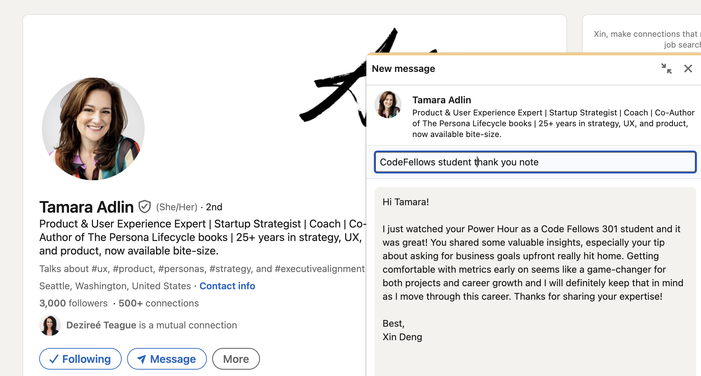

# Class 10 - Persistence

## Lab 10 - Advanced Topics

## Setup

It can be costly to hit an API over and over. For this lab, you will create an object in your server code to hold the API response data for your proxied queries. That way your back end can first check to see if you already have information about a given city and, if you do, send you the data directly from storage object, without concerns of being rate-limited by the API providers.

**Resources**

[Yelp API Docs](https://www.yelp.com/developers/documentation/v3/business_search)

**Process**

When available, your instructor will pair you with a partner for this lab. Review each other’s code from the previous lab and plan out an approach to this lab’s work on a whiteboard.

1. Do a formal code review of each person’s code (10 minutes each).
2. Open your partner’s GitHub pull request on your laptop.
3. Identify an area in the code that:
   - you don’t understand
   - or seems overly complex
   - or you see a way to improve
   - or you want more information on
   - or you really like or think is interesting
4. Add kind comments or questions inline using the GitHub review feature.
5. Draw the web request-response cycle for the current lab tasks (about 10 minutes).
6. Document the data flow: identify inputs and outputs for each part of the cycle.
7. Outline the functions that support this data flow.
8. Be sure to include these drawings in your README.md.
9. You will then work independently for the rest of the day, implementing your plan, coding in your own repository, submitting your own pull request.

**Workflow**

1. We will be using the Trello project management tool for the duration of this project.
2. To maximize your experience with Trello, you should create a free Trello account by clicking on the Sign Up button.
3. After creating an account, go to the [City Explorer Trello Board](https://trello.com/b/Ajj9Cbac/module-2-city-explorer), open the “… Show Menu” link, click the “… More” link, and then click “Copy Board”. Before you create it, be sure to “Change” from Private to “Public” (and click “Yes, Make Board Public”) so your instructional team can see your work. Now, click “Create” to add a copy to your personal account.
4. This Trello board contains all of the features required to complete this lab assignment.
5. Review the user stories and analyze the feature requests and requirements in the lab.
   Within each story, note the acceptance criteria (“Given … When … Then…”) and the checklist of feature tasks. Be careful to execute tasks in order as they are often dependencies of one another.
6. Throughout the lab time, check off tasks as you complete them, and move the story cards through the workflow.

**Documentation**

Your README.md must include:

# Project Name

**Author**: Your Name Goes Here
**Version**: 1.0.0 (increment the patch/fix version number if you make more commits past your first submission)

## Overview

<!-- Provide a high level overview of what this application is and why you are building it, beyond the fact that it's an assignment for this class. (i.e. What's your problem domain?) -->

## Getting Started

<!-- What are the steps that a user must take in order to build this app on their own machine and get it running? -->

## Architecture

<!-- Provide a detailed description of the application design. What technologies (languages, libraries, etc) you're using, and any other relevant design information. -->

## Change Log

<!-- Use this area to document the iterative changes made to your application as each feature is successfully implemented. Use time stamps. Here's an example:

01-01-2001 4:59pm - Application now has a fully-functional express server, with a GET route for the location resource. -->

## Credit and Collaborations

<!-- Give credit (and a link) to other people or resources that helped you build this application. -->

**Time Estimates**

For each of the lab features, make an estimate of the time it will take you to complete the feature, and record your start and finish times for that feature:

Name of feature: **************\_\_\_\_**************

Estimate of time needed to complete: **\_**

Start time: **\_**

Finish time: **\_**

Actual time needed to complete: **\_**

Add this information to your README.

**Submission Instructions**

1. Complete your Feature Tasks for the lab, according to the Trello cards.

1. Run your Lighthouse Accessibility report looking for a score of 65 or higher. Make adjustments as needed.
1. Create a PR back to the main branch of your repository, showing ALL your work, and merge it cleanly.
1. On Canvas, submit a link to your PR. Add a comment in your Canvas assignment which includes the following:
   - A link to the deployed version of your latest code.
   - A link to your public Trello board.
   - A question within the context of this lab assignment.
   - An observation about the lab assignment, or related ‘Ah-hah!’ moment.
   - How long you spent working on this assignment.

## Code Challenge - Two-dimensional arrays

Overview
[Read this overview.](https://codefellows.github.io/code-301-guide/curriculum/class-10/challenges/)

Video
[Watch the video for this class from the demo playlist.](https://www.youtube.com/playlist?list=PLVngfM2hsbi-L6G8qlWd8RyRbuTamHt3k)

Demonstration
[Look through these sample problems.](https://codefellows.github.io/code-301-guide/curriculum/class-10/challenges/DEMO.html)

Challenges
Navigate to the javascript folder within your data-structures-and-algorithms repository.

1. Create a new branch for this challenge called arrays-2d
   git checkout -b arrays-2d

2. Retrieve the code challenge from the system
   npm run get-challenge 10

3. In your terminal, from the javascript folder, run npm test 10 to execute the tests in this file for this challenge.

4. At this point you will see the failed tests scroll through your terminal window with a brief report of the number of failed tests at the bottom.

5. If you do not see this, verify your installation of Jest by typing npx jest --version in your terminal. Filename typos can make things break!

6. Write code to make the tests pass, one at a time. Let the error messages guide you.

7. Once the test is passing, refactor as needed, then move on to the next challenge.

8. Note, you can also run npm test (without a challenge number) to run all of the tests for every code challenge file assignment during the course all at once. This can get “noisy”, but it’s an opportunity to get a view of your overall progress

Submission
When you have completed the entire set of code challenges and all tests pass, create a pull request from your current branch to the main branch and merge it into main.

You will be able to see a test coverage report in GitHub on the Actions tab of your data-structures-and-algorithms repository. It should match what you saw on your terminal in the above steps. Your graders will be looking at this as well.

Submit a link to your pull request.

## Written Class Notes

## Read 10 - Readings Overview

## Resources Link/Pages

**Bookmark and Review**

- [JavaScript errors reference on MDN](https://developer.mozilla.org/en-US/docs/Web/JavaScript/Reference/Errors)

### Understanding the JavaScript Call Stack

1. [Understanding the JavaScript Call Stack](https://learn.microsoft.com/en-us/azure/architecture/best-practices/api-design)

### JavaScript error messages

1. [JavaScript error messages](https://codeburst.io/javascript-error-messages-debugging-d23f84f0ae7c)

## Answer

Statement on why this topic matter as it relates to what I'm studying in this module:

Understanding how to manage the call stack ensures efficient code execution, while knowing how to debug helps with identifying and rectifying errors.

### Understanding the JavaScript Call Stack

1. What is a ‘call’?
   - The invocation or execution of a function. It occurs when a program directs the computer to execute a specific function or subroutine.
1. How many ‘calls’ can happen at once?
   - The call stack in JavaScript is single-threaded, meaning it can handle only one function execution at a time from top to bottom. It means the call stack is synchronous.
1. What does LIFO mean?
   -Cal stack is a data structure that uses LIFO, stands for Last In, First Out to temporarily store and manage function calls. In the context of the call stack, it means that the last function that is called is the first to be executed and removed from the stack when the function returns.
1. Draw an example of a call stack and the functions that would need to be invoked to generate that call stack.

- Example from reading:

        function firstFunction(){
          console.log("Hello from firstFunction");
        }

        function secondFunction(){
          firstFunction();
          console.log("The end from secondFunction");
        }

        secondFunction();

        1. When secondFunction() gets executed, an empty stack frame is created. It is the main (anonymous) entry point of the program.
        2. secondFunction() then calls firstFunction()which is pushed into the stack.
        3. firstFunction() returns and prints “Hello from firstFunction” to the console.
        4. firstFunction() is pop off the stack.
        5. The execution order then move to secondFunction().
        6. secondFunction() returns and print “The end from secondFunction” to the console.
        7. secondFunction() is pop off the stack, clearing the memory.

1. What causes a Stack Overflow?
   - A stack overflow occurs when there is a recursive function (a function that calls itself) without a proper exit condition. The call stack accumulates function calls without resolving any, eventually reaching a maximum limit set by the browser, leading to a "Maximum call stack size exceeded" error.

### JavaScript error messages

1. What is a ‘reference error’?
   - When you try to use a variable that has not been declared. This is also a common thing when using const and let and the fix is as simple has declaring the variable before any declaration is made.
1. What is a ‘syntax error’?
   - When there's a problem with the structure of your code that prevents it from being parsed correctly
1. What is a ‘range error’?
   - When you manipulate an object with a length property and give it an invalid length,
1. What is a ‘type error’?
   - When you try to use or access incompatible types, such as accessing a property in an undefined variable:
1. What is a breakpoint?
   - A breakpoint is a designated point in your code where the debugger should pause or break the execution. It allows you to inspect the state of your program at that specific point.
1. What does the word ‘debugger’ do in your code?
   - A debugging statement. Placing the debugger statement in your code acts as a breakpoint. When the code execution reaches this statement, it pauses, allowing you to inspect variables and step through the code using a debugger tool.

## Things I want to know more about

- Why do we use LIFO, wouldn't it make sense that the first written is the first executed if read from top down?

## Retrospective

Retrospectives are a critical part of Agile, and typically take the form of meetings held by a team at the end of a sprint cycle. To get us acclimated to that process, we will use the format of a retrospectives to guide today’s reflection.

This [article](https://www.benlinders.com/2013/which-questions-do-you-ask-in-retrospectives/) gives a nice overview to the role of retrospectives.

1. What went well, that I might forget if I don’t write down?
2. What did I learn today?
3. What should I do differently next time?
4. What still puzzles me, or what do I need to learn more about?
5. Thinking about each of your assignments for the day, reflect on:
   - Is the assignment complete? If not, where exactly did you leave off, and what work remains?
   - Do not get bogged down in written analysis; instead, focus on capturing the moment with an eye toward how your observations can guide you toward future productivity.

## Career 10 - Weekly Partner Power Hour Report

> If there is no live presentation on campus in this module, select the appropriate presentation from the list below. All presenters are open to connections and invite you to reach out to them, so that you can to learn more about them, their company, and the industry.
> You may find it difficult or challenging to connect with industry professionals and gain an inside look at how the tech world operates. We’ve drawn on our network to bring you speakers and topics relevant to this stage of your career transition. These presentations may serve to educate, enlighten, and motivate you along your journey. Take advantage of this opportunity, and make the most of the insights these presentations provide… you never know where a connection will lead.

[Oops —- I did Git Again - Hexx King](https://www.youtube.com/watch?v=p2rffnhw9Ec)

[The Best User-Centered Design Tool Has Nothing to do With Users - Tamara Adlin](https://www.youtube.com/watch?v=obmPjZ7qUkI)

[How To 10x Your Confidence - Micha Goebig Assignment](https://www.youtube.com/watch?v=LONfwt-aZ3U)

> The Best User-Centered Design Tool Has Nothing to do With Users - Tamara Adlin

1. Share one or two ways the speaker’s information will change your approach to your career transition.

   - Don’t assume executives know exactly what they want you to build and why and that they all agree on this because they’re very good at looking like they do but they don’t
   - Business goals are always ok to ask for because the earlier you get comfortable with the idea of creating and understanding metrics for each element of your project the better off you’ll be and the more your career will soar because if you can learn to speak the language of the executives, you’re gonna deliver better work

1. List a few key take-aways from this presentation.

   - Lack of alignment, look for it up top because you can’t make a good product if organization isn’t aligned
   - Create lists of wants and needs to change conversation around users and even create alignment personas
   - What we need from executives: what they want us to build, for who, how is it better or different than what’s out there, why should customers care, and how will we know we made a good product.
   - Understand ‘USER’, be specific so the clearer you can get about who we’re building it for and what they care about the more likely we are to build something they love. So ask:
     - Who are they
     - What motivates them
     - What problems do they have, in their own words
     - Which ones are we focusing on
   - Data doesn't solve anything about user
   - The best alignment you can get is alignment around business goals and a shared, prioritized and useful description of users.
     - Write down descriptions of your most important users
     - Send an email to ask friends on the team to describe three most important users and include details for each user (do the answers match?)
     - Send email to boss what are the measurable metrics for success for the project you’re working on right now
   - Find success metrics conversions online for business goals ex increase visitors who subscribe by 20%

1. Share a screenshot of your LinkedIn connection request, including a nicely worded note, sent to the speaker or someone else at their company.
   

