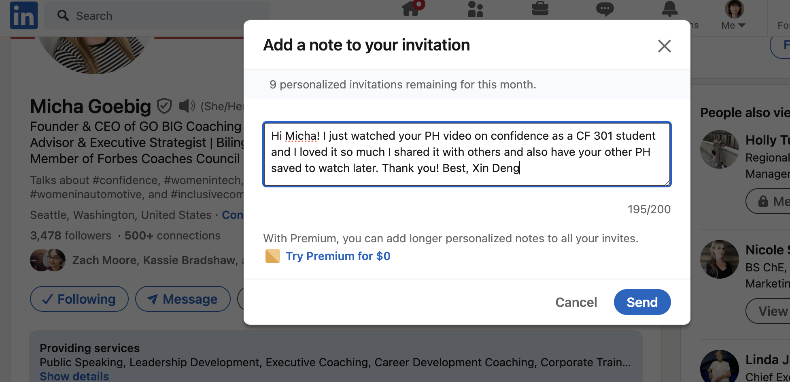

# Class 15 - Final Project Kick-off

## Lab 15 - User Authentication with Auth0

## Setup

Right now, books in your app aren’t associated with who added them. Let’s ensure only you can edit your books. To do this, we will need an authentication system to know a user is indeed who they say they are. But we don’t want to deal with storing passwords… let’s outsource it! Think about all the times you have signed up for an app using your Facebook or Google account. That is done through a process called OAuth. Essentially, the app allows “someone else” (an external identity “provider”) to take care of making sure that you are who you say you are.

In this lab, we are going to use a service called Auth0 that will handle most of the challenges of working with external identity providers. Your job will be to create React components to allow users to sign in via the Auth0 service. This service will then give you a secure jsonwebtoken or JWT (pronounced “jot”).

Once you have that hooked up, you will send that JWT (that essentially says that you are who you say you are) to your backend. You will use a library call jsonwebtoken on the server to open the JWT and will verify whether it is valid, and who the user is.

You will be provided starter code libraries for both your React application and your Express server to aid you in this process. Your job in this lab will be to integrate these modules and components into your client and server applications, not to write this functionality from scratch.

**Feature Tasks**

1. See your team’s Trello board for this lab’s feature tasks.

**Documentation**

Your README.md must include:

# Project Name

**Author**: Your Name Goes Here
**Version**: 1.0.0 (increment the patch/fix version number if you make more commits past your first submission)

## Overview

<!-- Provide a high level overview of what this application is and why you are building it, beyond the fact that it's an assignment for this class. (i.e. What's your problem domain?) -->

## Getting Started

<!-- What are the steps that a user must take in order to build this app on their own machine and get it running? -->

## Architecture

<!-- Provide a detailed description of the application design. What technologies (languages, libraries, etc) you're using, and any other relevant design information. -->

## Change Log

<!-- Use this area to document the iterative changes made to your application as each feature is successfully implemented. Use time stamps. Here's an example:

01-01-2001 4:59pm - Application now has a fully-functional express server, with a GET route for the location resource. -->

## Credit and Collaborations

<!-- Give credit (and a link) to other people or resources that helped you build this application. -->

**Time Estimates**

For each of the lab features, make an estimate of the time it will take you to complete the feature, and record your start and finish times for that feature:

Name of feature: **************\_\_\_\_**************

Estimate of time needed to complete: **\_**

Start time: **\_**

Finish time: **\_**

Actual time needed to complete: **\_**

Add this information to your README.

**Submission Instructions**

1. Complete your Feature Tasks for the lab, according to the Trello cards.
2. Run your Lighthouse Accessibility report looking for a score of 65 or higher. Make adjustments as needed.
3. Create a PR back to the main branch of your repository, showing ALL your work, and merge it cleanly.
4. On Canvas, submit a link to your PR. Add a comment in your Canvas assignment which includes the following:
   - A link to the deployed version of your latest code.
   - A link to your public Trello board.
   - A question within the context of this lab assignment.
   - An observation about the lab assignment, or related ‘Ah-hah!’ moment.
   - How long you spent working on this assignment.

## Code Challenge - None

## Written Class Notes

## Read 15 - Readings Overview

## Resources Link/Pages

**Bookmark and Review**

1. [Auth0 for single page apps](https://auth0.com/docs/libraries/auth0-react)

### What is OAuth

1. [What is OAuth](https://www.csoonline.com/article/562635/what-is-oauth-how-the-open-authorization-framework-works.html)

### Authorization and Authentication flows

1. [Authorization and Authentication flows](https://auth0.com/docs/get-started/authentication-and-authorization-flow)

## Answer

Statement on why this topic matter as it relates to what I'm studying in this module:

OAuth is a common method for authenticating API requests, ensuring that only authorized users or applications can access protected resources.

### What is OAuth

1. What is OAuth?
   - "Open Authorization," is an open-standard authorization protocol or framework that enables unrelated servers and services to securely grant authenticated access to their assets without sharing the original logon credentials.
1. Give an example of what using OAuth would look like.
   - When a user wants to log into a website and is given the option to use logins from another website to authenticate. The user clicks on the option, and the second website authenticates them. The original website then logs them in using the permission obtained from the second website without the need for a separate logon.
1. How does OAuth work? What are the steps that it takes to authenticate the user?
   - The first website connects to the second website on behalf of the user, providing the user's verified identity.
   - The second site generates a one-time token and a one-time secret unique to the transaction.
   - The first site gives this token and secret to the user's client software.
   - The client's software presents the request token and secret to their authorization provider.
   - If not already authenticated, the client may be asked to authenticate and approve the authorization transaction.
   - The user approves the transaction type at the first website.
   - The user receives an approved access token.
   - The user provides the access token to the first website.
   - The first website gives the access token to the second website as proof of authentication.
   - The second website allows the first website to access its resources on behalf of the user.
1. What is OpenID?
   - Authentication protocol designed for humans logging into machines. It allows users to use a single set of credentials to log in to multiple websites.

### Authorization and Authentication flows

1. What is the difference between authorization and authentication?
   - Authorization: the process of granting or denying access to specific resources or actions based on the authenticated user's permissions.
   - Authentication: the process of verifying the identity of a user, ensuring that the user is who they claim to be.
1. What is Authorization Code Flow?
   - OAuth 2.0 flow suitable for regular web applications where the source code is not publicly exposed. It involves exchanging an Authorization Code for a token, providing a secure method for authentication.
1. What is Authorization Code Flow with Proof Key for Code Exchange (PKCE)?
   - Version of the Authorization Code Flow designed for mobile and native applications. It adds an extra layer of security by using a Proof Key for Code Exchange to mitigate security risks associated with these application types.
1. What is Implicit Flow with Form Post?
   - Alternative to the Authorization Code Flow, intended for Public Clients that cannot securely store Client Secrets
1. What is Client Credentials Flow?
   - Suitable for machine-to-machine (M2M) applications, where the system authenticates and authorizes the application rather than a user.
1. What is Device Authorization Flow?
   - Input-constrained devices that connect to the internet. Instead of authenticating the user directly, the device prompts the user to authorize it through a link on another device.
1. What is Resource Owner Password Flow?
   - Not recommended for general use but can be employed by highly-trusted applications. It involves requesting users to provide their credentials directly, typically using an interactive form. It should only be used when other redirect-based flows cannot be applied.

## Things I want to know more about

- What determines what authorization is more suitable for websites?

## Retrospective

Retrospectives are a critical part of Agile, and typically take the form of meetings held by a team at the end of a sprint cycle. To get us acclimated to that process, we will use the format of a retrospectives to guide today’s reflection.

This [article](https://www.benlinders.com/2013/which-questions-do-you-ask-in-retrospectives/) gives a nice overview to the role of retrospectives.

1. What went well, that I might forget if I don’t write down?
2. What did I learn today?
3. What should I do differently next time?
4. What still puzzles me, or what do I need to learn more about?
5. Thinking about each of your assignments for the day, reflect on:
   - Is the assignment complete? If not, where exactly did you leave off, and what work remains?
   - Do not get bogged down in written analysis; instead, focus on capturing the moment with an eye toward how your observations can guide you toward future productivity.

## Career 15 - Weekly Partner Power Hour Report

> If there is no live presentation on campus in this module, select the appropriate presentation from the list below. All presenters are open to connections and invite you to reach out to them, so that you can to learn more about them, their company, and the industry.
> You may find it difficult or challenging to connect with industry professionals and gain an inside look at how the tech world operates. We’ve drawn on our network to bring you speakers and topics relevant to this stage of your career transition. These presentations may serve to educate, enlighten, and motivate you along your journey. Take advantage of this opportunity, and make the most of the insights these presentations provide… you never know where a connection will lead.

[Oops —- I did Git Again - Hexx King](https://www.youtube.com/watch?v=p2rffnhw9Ec)

[The Best User-Centered Design Tool Has Nothing to do With Users - Tamara Adlin](https://www.youtube.com/watch?v=obmPjZ7qUkI)

[How To 10x Your Confidence - Micha Goebig](https://www.youtube.com/watch?v=LONfwt-aZ3U)

> How To 10x Your Confidence - Micha Goebig

1. Share one or two ways the speaker’s information will change your approach to your career transition.

   - Biggest downfall of people making a career change is they don't make the distinction of what is in my hands and what is out of my control and define that as success understanding you know you're doing your best job, you showed up as your best self today which is not the same everyday. Will definitely keep this in mind because I do get discouraged about things.
   - Need to have a success measure that is irrespective of what the other people do, have one for yourself because that's the one you can actually influence and find things you know about yourself to be true that you can use like a little mantra

2. List a few key take-aways from this presentation.

   - You do not have to believe your brain, it’s misguided sometimes
   - Confidence is not a personality but something you can choose and create
   - Leaders feel fear, they doubt themselves but they just act anyway. People who show up as people leaders and anyone can do that.
   - You are responsible to learn, to acknowledge the fear and say okay this is unpleasant or uncomfortable or really scary but not in a life endangering way and then act and this is how you can choose and create confidence
   - Five step process
     - **Gauge** - confidence is a story we tell ourselves
       - Ask yourself:
         - what do you see in people you consider very confidence
         - Which thoughts and stories hold you back from being confident
         - Are you willing to give those beliefs up? If you have a victim mindset giving that up means you have to take responsibility for your stuff
       - Career change - good time to update your personal operating system
     - **Convey** - confidence is recallable, think about something that makes you feel really good about yourself
     - **Embark** - confidence is the result of action
       - I did it once, i didn't die so i can go again
       - Thinking i could be good at this, you feel miserable now, but think it could be fun and think you could be good at it and probably it could get better from there
       - Reframe it and ask yourself:
         - What went well WWW
         - What didn’t go well WDW
         - What would i do different WDD (helps you see some things might be in your control so you can decide to try something else but other things you just can’t change, makes you see oh those things that didn't go well, well that's just life, it's not something you messed up on)
         - Every sunday reflect on the week with the questions above
     - **Integrate** - reward yourself to step up your self advocacy game
       - Ask yourself
         - What can i do for myself to celebrate that i did the thing (think beforehand especially with scary things, what's the nice thing you can do for yourself just for doing it, does not matter if you mess up but you just did step into the arena)
         - What's the one thing i am proud of today (jar of notes, it’s how you condition yourself and that makes it a lot easier to tell others i did a great thing i’m so proud of myself becomes way easier if you start writing it, talk to yourself in the mirror also great for reconditioning your brain)

3. Share a screenshot of your LinkedIn connection request, including a nicely worded note, sent to the speaker or someone else at their company.

   
