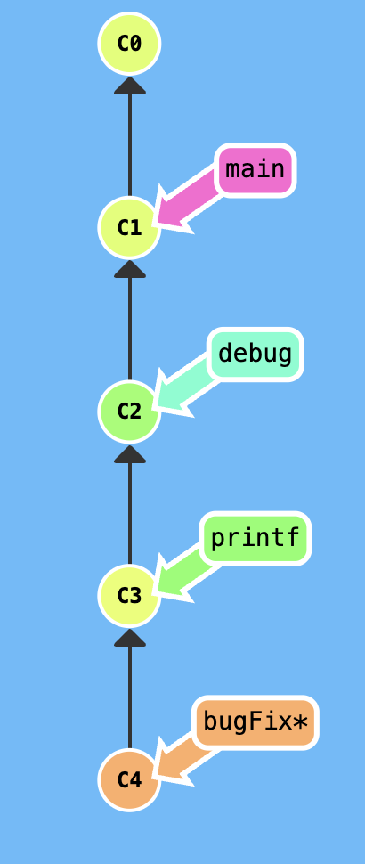
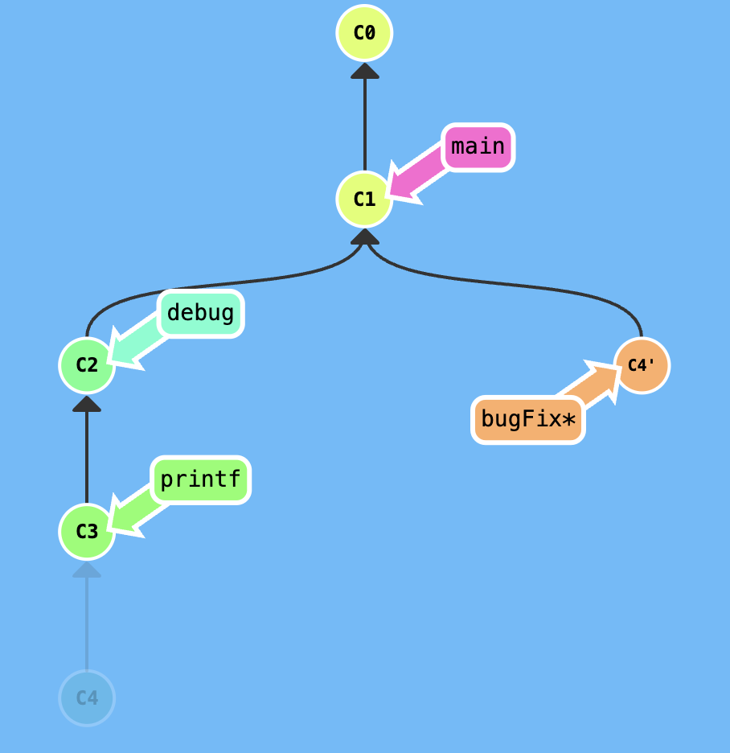
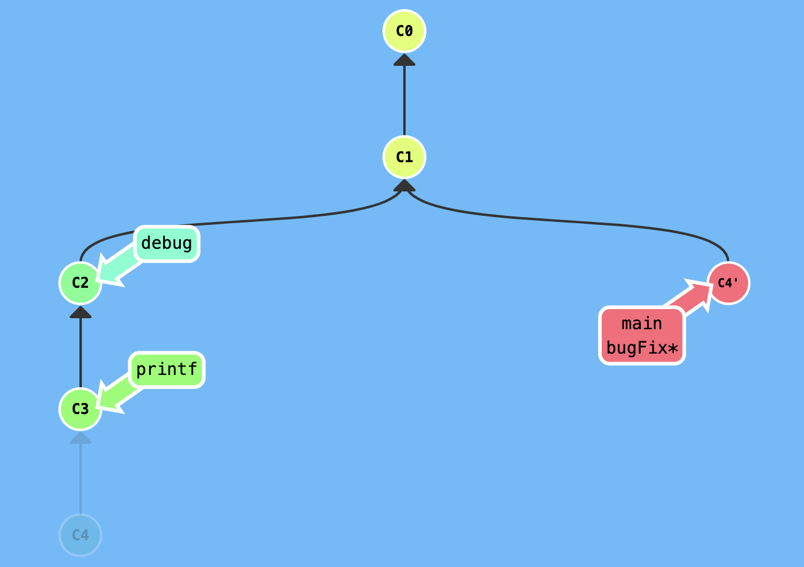

# 201 Prework - Learning GIT

Site: [Learn Git Branching](https://learngitbranching.js.org/)

## Notes

1. Parent commit: the reference for the new commit it was based off of
2. Branching:
   - `git checkout branchName`: puts you on the correct branch before committing changes
   - `git checkout -b branchName`: shortcut to create new branch and check it out at the same time
3. Merge:
   - `git merge`: special commit that has 2 parent (branch)
   - move to the main branch you want to merge things into
     - `git checkout main` then `git merge branchName`
       a. `git checkout -b branchName`
       b. `git commit -m ""`
       c. `git checkout main`
       d. `git commit -m ""`
       e. `git merge branchName`
4. `Rebase`: another way of combining work between branches
   - takes a set of commits, copies them and plops them down somewhere else, creating a nice linear sequence of commits so the commit log/history will be cleaner.
    a. `git rebase main`: be on the branch you need things moved into main first
    b. go on main and then use `git rebase branchName` (main will move to branchName since it was the ancestor)
5. Moving around in GIT
   - `HEAD`: most recent commit
   - Detaching HEAD: attaching to a commit instead of a branch, instead of `git checkout branchName` its `git checkout commitNumber`
6. Relative Reference
   - Move upwards one commit at a time with `^`
   - Move upwards a number of times with `~<num>`
      - `git checkout HEAD~4` moves up the amount of times the number added
   - `HEAD` can be used as a relative ref but typing `HEAD^`
      - `^` tells git to find the parent of specified commit for example `main^` means to find the first parent of main
   - Use RR to move branches around
      - Can directly reassign a branch to a commit with `-f`or branch forcing
      - `git branch -f main HEAD~3` means move main branch to 3 parents behind HEAD
      - quick way to move branch to a commit
7. Reverse GIT Changes in two Ways
   - `git reset HEAD~1`
      - moves branch backwards one as if the commit had never been made in the first place (works for local branch not remote where others use)
   - `git revert` reverses changes and share those changes with others
      - produces a new commit with changes so you can then push to share 
8. Moving work around
   - `git cherry-pick`: use `git cherry-pick <commit1><commit2>...`
      - it copies a series of commits below you current location (HEAD)
   - `Interactive Rebase`: best way to review a series of commits you're about to rebase
      - `git cherry-pick`is great when you know which commit you want and you know their hashes number, but what about when you don't know what commit you want?
      - `git rebase -i HEAD~4` or where ever, a new window will pop up where you can `omit/pick/reorder` commits
   - if you want to grab one commit use `git rebase -i` or `git cherry-pick`
   - Example exercise from site above: grab commit 4 with the bugFix and move main to that commit
      
      - You are on the bugFix commit and want to make a copy commit below the commit where the main branch is at. use `git rebase -i HEAD~3` which means create a copy and move backwards three commits of the commit you are at (HEAD). A pop up window will show up and omit commit 2 and 3 because you only want the commit with the bugFix.
      
      - Now move `main` branch into the new copy commit using `git branch -f main HEAD` which means force or reassign the branch `main` to the `HEAD` commit
      
