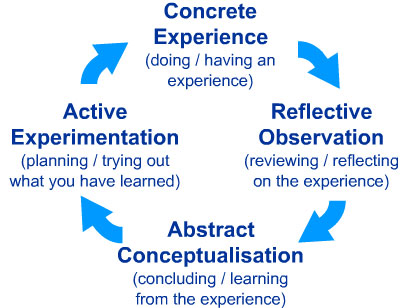

# Class 1 - Introduction to Python

## Lab 1 - Ensuring our computers and minds are prepared for Python

### Overview

Today you’ll begin working on a command line utility which will mimic the functionality of a point of sale restaurant system using your basic Python tools and understanding of the basics of the language.

### Feature Tasks and Requirements

- When run, the program should print an intro message and the menu for the restaurant
- The restaurant’s menu should include appetizers, entrees, desserts, and beverages.
- The program should prompt the user for an order
- When a user enters an item, the program should print an acknowledgment of their input
- The program should tell the user how to exit
- The program’s content should match included sample exactly
- Actually, there’s one tiny spot that should be different - see if you can spot it.
- The `>` character represents user input line and should be printed out with a trailing space.

```bash
$ python snakes_cafe.py
**************************************
**    Welcome to the Snakes Cafe!   **
**    Please see our menu below.    **
**
** To quit at any time, type "quit" **
**************************************

Appetizers
----------
Wings
Cookies
Spring Rolls

Entrees
-------
Salmon
Steak
Meat Tornado
A Literal Garden

Desserts
--------
Ice Cream
Cake
Pie

Drinks
------
Coffee
Tea
Unicorn Tears

***********************************
** What would you like to order? **
***********************************
>
```

#### Entering an order

```bash
***********************************
** What would you like to order? **
***********************************
> Cake

** 1 order of Cake has been added to your meal **

> Cake

** 2 orders of Cake have been added to your meal **
```

#### Exiting

```bash
> quit
```

### Stretch Goals

- Print out a summary of the complete order.
- Only allow ordering items on the menu.
- Allow ordering items not on the menu but give a custom reply.

### Configuration

Create a project named `snakes-cafe`.

Create a `snakes_cafe.py` file inside the project folder. Note the hyphen vs. underscore

Your file structure should look like this.

```
├── snakes-cafe
│   ├── README.md
│   └── snakes_cafe.py
```

### Repository set-up

Create a repository on Github with the exact name of `snakes-cafe`.
See the Github section of Lab Submission Instructions for additional details.

### Submission Instructions

Refer to the Lab Submission Instructions for the complete lab submission process and expectations.
You may have noticed many references to Lab Submission Instructions. That’s on purpose. Getting the steps exactly right is crucial. So make sure you follow them closely.

## Setup

[Python Setup guide](https://codefellows.github.io/code-401-python-guide/reference/submission-instructions/labs/)

### Creating Project

```bash
mkdir example-lab
cd example-lab
touch README.md
```

### Create virtual environment

```bash
python3 -m venv .venv
```

**NOTE:** Replace `python3` with a more specific version as needed.

#### Activate virtual environment

**Mac/Linux:**

```bash
source .venv/bin/activate
```

**Windows:**

```bash
source .venv/Scripts/activate
```

### Create modules and scripts

```bash
mkdir example_lab
touch example_lab/example_script.py
```

_Note the underscore vs hyphen_

### Install packages

For example:

```bash
pip install favorite-library
```

### Record package dependencies

```bash
pip freeze > requirements.txt
```

Should result in this file tree:

```
└── example-lab
    ├── README.md
    ├── requirements.txt
    └── example_lab
        └── example_script.py
```

### Tests

Many labs will require automated testing. If your lab requires it, then install pytest or pytest-watch.

```bash
pip install pytest # or pytest-watch
pip freeze > requirements.txt
touch tests/__init__.py # (Note: 2 underscores on both sides.)
touch tests/test_example.py
```

Should result in a file tree like this:

```
└── example-lab
    ├── README.md
    ├── requirements.txt
    ├── example_lab
    │   └── example_script.py
    └── tests
        ├── __init__.py
        └── test_example.py
```

### README

Your project’s README.md should match the structure of the template README.

### Git

#### On Local System

```bash
git init
touch .gitignore
```

Add `.venv` folder to `.gitignore`

```bash
git add .
git commit -m "first commit"
```

#### On Github site

Create an EMPTY repository `example-lab` on Github. **DO NOT initialize with README, license, or gitignore.**
Those will be added soon.

The next screen will have a “Quick Setup” section with a URL available to copy. Copy it ;)

#### On local system (again)

```bash
git remote add origin the_url_you_copied_that_ends_with_git
git push -u origin main
```

Now everything is wired up between the local machine and Github.

### Canvas Submission

Submit a link to the `README.md` from your assignment branch in Canvas.

#### Resubmits

Any commits made to the submission branch will be updated in the PR.

In the event of assignment resubmission, submit the submission branch PR on canvas.

### Github Actions

This step is optional early in the course. The instructor will inform you when it is required.

Setup “Github Actions” so that your code can be properly tested in Github as you make new pushes to your branches and pull requests to master.

Include the following YAML code:

```yaml
name: Run Python Tests

on:
  push:
    branches:
      - main
    paths:
      - "python/**"
  pull_request:
    branches:
      - main
    paths:
      - "python/**"

jobs:
  ci:
    runs-on: ubuntu-latest
    steps:
      - uses: actions/checkout@v2
      - name: Set up Python 3.9
        uses: actions/setup-python@v2
        with:
          python-version: 3.9
      - name: Install dependencies
        run: |
          python -m pip install --upgrade pip
          pip install -r requirements.txt
        working-directory: ./python
      - name: Test with pytest
        run: pytest -vv
        working-directory: ./python
```

## Code Challenge

### Reverse an Array

#### Specifications

- Read all of the following instructions carefully.
- Name things exactly as described.
- Do all your work in a public repository called data-structures-and-algorithms.
- Create a new branch in your repo called array-reverse.
- Make a directory for this challenge, named according to your language’s conventions, containing a README.md file.
- Update the “Table of Contents” - in the README at the root of the repository - with a link to this challenge’s README file.

**NOTE:** This challenge is whiteboard only. Write out code as part of your whiteboard process, but don’t worry about creating external program files.

#### Feature Tasks

Write a function called `reverseArray` which takes an array as an argument. Without utilizing any of the built-in methods available to your language, return an array with elements in reversed order.

##### Example

| Input                                         | Output                                    |
| --------------------------------------------- | ----------------------------------------- |
| [1, 2, 3, 4, 5, 6]                            | [6, 5, 4, 3, 2, 1]                        |
| [89, 2354, 3546, 23, 10, -923, 823, -12]      | [-12, 823, -923, 10, 23, 3546, 2354, 89]  |
| [2, 3, 5, 7, 11, 13, 17, 19, 23, 29, 31, ...] | [199, 197, 193, 191, 181, ... 7, 5, 3, 2] |

#### Structure and Testing

- Utilize the Single-responsibility principle: any methods you write should be clean, reusable, abstract component parts to the whole challenge. You will be given feedback and marked down if you attempt to define a large, complex algorithm in one function definition.

#### Stretch Goal

Once you’ve achieved a working solution, implement the same feature with a different methodology. (Hint: what different techniques do you have when working with arrays? Recursion, loops, indexes, modifying the array input directly…) In other words, use a different algorithm & pseudocode to solve the same problem. Then compare approaches for efficiency, readability, flexibility, etc.

#### Submission Instructions

- Work within the proper folder structure for your language, and as dictated by the challenge instructions.
- Create a new README for this challenge, using the README TEMPLATE provided.
- Embed an image of your completed whiteboard, matching the example whiteboard layout.
- In addition to whiteboard drawing, optionally complete the code written on your whiteboard, along with a proper suite of tests.
- Try giving your algorithm to a chatbot and see if it can produce working code and tests.
- Create a pull request from your branch to the main branch.
- In your open pull request, comment with the following checklist of tasks:

  - [ ] Top-level README “Table of Contents” is updated.
  - [ ] README for this challenge is complete.
    - [ ] Summary, Description, Approach & Efficiency, Solution.
    - [ ] Picture of whiteboard.
    - [ ] Link to code.
  - [ ] Feature tasks for this challenge are completed.
  - [ ] Unit tests written and passing.
    - [ ] “Happy Path” - Expected outcome.
    - [ ] Expected failure.
    - [ ] Edge Case (if applicable/obvious).

- Submit your completed work:
  - Copy the link to your open pull request and paste it into the assignment submission field.
  - Leave a description of how long this assignment took you in the comments box.
  - Add any additional comments to your grader about your process or any difficulties you may have had with the assignment.
- Merge your branch into main, and delete your branch (don’t worry, the PR link will still work).

## Written Class Notes - None

## Read 1 - Big O

## Resources Link/Pages

- [Pain and Suffering](https://react.dev/learn/tutorial-tic-tac-toe)
- [Beginners Guide to Big O](https://legacy.reactjs.org/docs/hello-world.html)
- [Season 1, Episode 6, A friendly intro to Big O Notation](https://legacy.reactjs.org/docs/introducing-jsx.html)
- [Names and Values in Python](https://legacy.reactjs.org/docs/rendering-elements.html)

**Bookmark and Review**

- [Python Module of the Week](https://legacy.reactjs.org/docs/components-and-props.html)

## Answer

Statement on why this topic matter as it relates to what I'm studying in this module:

Understanding that growth involves some level of discomfort and challenges and you might face a lot of it learning python.

### Pain and Suffering

1. In the context of the reading “Pain and Suffering,” describe the main challenges faced by beginners when learning Python and suggest at least two strategies for overcoming these obstacles.

   - Mental Strain: mentally challenging to think their way through complex programming problems and when confronted with topics that are initially unfamiliar.
   - Emotional Stress: The constant exposure to one's lack of understanding, collaboration with others, and dealing with uncertainty can lead to emotional stress.

Strategies to Overcome:

Collaborative Learning: collaborate with peers and engage in group discussions. Collaboration not only provides diverse perspectives but also helps in dealing with emotional challenges by fostering a sense of shared experience and collective growth.

Mindset Shift: shift perspective and view the challenges as opportunities for growth rather than obstacles. Emphasize the importance of building a positive mindset that acknowledges the pain of growth but also recognizes it as a temporary phase leading to valuable skills and a better future. Encourage setting clear goals

### Beginners Guide to Big O

1. After reading “Beginners Guide to Big O,” explain the concept of time complexity and space complexity.

   - Time complexity is a measure of the amount of time an algorithm takes to complete as a function of the size of the input data. It provides an understanding of how the algorithm's performance scales with larger datasets.
   - Space complexity is a measure of the amount of memory or space an algorithm requires concerning the size of the input data. It helps assess how efficiently an algorithm uses memory.

### Names and Values in Python

1. Based on the “Names and Values in Python” reading, explain the difference between mutable and immutable data types in Python.

- Mutable Data Types:
  - Objects of mutable data types can be altered or modified after creation.
  - Changes made to the object directly affect the original object.
  - Examples of mutable data types include lists, dictionaries, and sets.
- Immutable Data Types:
  - Objects of immutable data types cannot be changed after they are created.
  - Any operation that appears to modify the value of an immutable object actually creates a new object.
  - Examples of immutable data types include strings, numbers (integers, floats), and tuples.

## Things I want to know more about

What exactly is the application of big o notation, where is it used?

## Read 1.1 - Data Structures and Algorithms Prep Reading and Videos

## Resources Link/Pages

- [Basic Recursion](https://www.youtube.com/watch?v=vPEJSJMg4jY)
- [Data Structures in 15 Minutes](https://www.youtube.com/watch?v=sVxBVvlnJsM)
- [Big O Explained](https://www.youtube.com/watch?v=v4cd1O4zkGw)
- [Basic Data Structures](https://towardsdatascience.com/8-common-data-structures-every-programmer-must-know-171acf6a1a42)
- [Why Big O](https://web.archive.org/web/20230207075759/https://triplebyte.com/blog/why-you-should-learn-big-o-and-stop-hacking-your-way-through-algorithms)

## Answer

Statement on why this topic matter as it relates to what I'm studying in this module:

Understanding the characteristics and performance of different data structures allows programmers to select the most appropriate one for a given problem.

### Data Structures and Algorithms

1. What is 1 of the more important things you should consider when deciding which data structure is best suited to solve a particular problem?

   - the efficiency of the operations required to solve the problem. Different data structures excel in different operations. For example, arrays are great for random access, linked lists for sequential access, hash tables for fast lookups, and trees for hierarchical relationships. Analyzing the specific requirements of the problem and understanding the time and space complexity of operations will help in selecting the most appropriate data structure.

2. How can we ensure that we’ll avoid an infinite recursive call stack?
   - implement a base case in your recursive function. The base case defines a condition under which the function stops calling itself and returns a result. Without a proper base case, the recursion would continue indefinitely, leading to a stack overflow. Ensuring that your recursive function has a well-defined termination condition is essential for preventing infinite recursion.

## Things I want to know more about

I want to know more about advanced data structures like Graphs and Heaps

## Learning Journal

### Today I Learned

One of the most effective tools in adult learning is reflection. By writing coherent summaries of lessons learned, we cement that learning and deepen our understanding of a subject. It also helps us to measure our progress.

#### Andragogy vs. Pedagogy

Maybe you’ve seen a graphic similar to this before?




This is a learning style model developed by researcher David Kolb, and it is a core principle in the way our curriculum is designed and our instruction is delivered at Code Fellows. Note the “Reflective Observation” component; it is that piece that is a primary differentiator between the way adults learn and the way children learn.

As an adult, learning is different for you now than it was when you were younger. Do a quick read of [this article](link to the article) that describes the differences between andragogy (adult-focused learning) and pedagogy (child-focused learning).

Over the duration of this course, there will be a series of learning journal assignments where you will be prompted to reflect on your learning. The reflection is a critical part of adult learning, and the self-awareness that results is a key component of emotional intelligence. Initially, these journal assignments will give you prompts to get you started, but as time goes by, some assignments will be less structured so that you explore your thoughts with more self-determination and freedom.

### Reflection

Write a brief reflection on your learning today, or use the prompt below to get started.

Consider the following quote from the article linked above:

“[Adult learners] are deeply involved not only in planning but also in evaluating their learning, as they know what knowledge they want to acquire.”

In other words, you should continuously evaluate your learning, and your learning journal is an excellent way to keep track of that. How do you see yourself planning and evaluating your learning? What details will you record and/or measure? How often will you evaluate what you want to learn?

- I like the way I am detailing my learning now. I think my notes and how much I put into them already kind of shows a learning plan where I list resources that I can use throughout my learning that I can always come back to. The way my notes are organized also details topics I do not understand and I can always refer back to those in that future. I think I need to start making goals to evaluate my learning and then for each learning journal reflection assignment I can assess whether I've met them or need more improvement. For now, I really want to understand the topics introduced in python first like different syntax.
