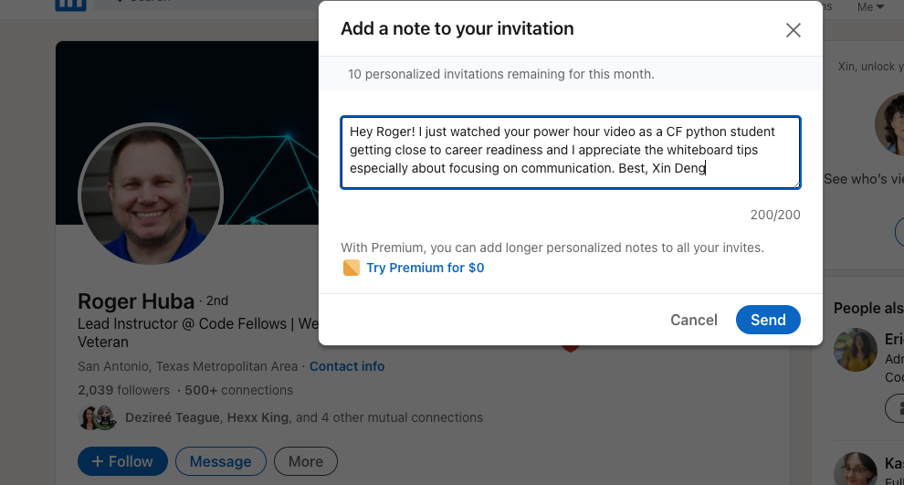

# Class 10 - Stacks, Queues, Personal Pitch Workshop

## Lab 10 - None

## Code Challenge - Stack, Queue Implementations


- **Branch Name:** stack-and-queue

Challenge Type: New Implementation

### Features

#### Node

Create a Node class that has properties for the value stored in the Node, and a pointer to the next node.

#### Stack

Create a Stack class that has a top property. It creates an empty Stack when instantiated. This object should be aware of a default empty value assigned to top when the stack is created.

The class should contain the following methods:

- **push**

  - Arguments: value
  - Adds a new node with that value to the top of the stack with an O(1) Time performance.

- **pop**

  - Arguments: none
  - Returns: the value from the node from the top of the stack
  - Removes the node from the top of the stack
  - Should raise an exception when called on an empty stack

- **peek**

  - Arguments: none
  - Returns: Value of the node located at the top of the stack
  - Should raise an exception when called on an empty stack

- **is_empty**
  - Arguments: none
  - Returns: Boolean indicating whether or not the stack is empty.

#### Queue

Create a Queue class that has a front property. It creates an empty Queue when instantiated. This object should be aware of a default empty value assigned to the front when the queue is created.

The class should contain the following methods:

- **enqueue**

  - Arguments: value
  - Adds a new node with that value to the back of the queue with an O(1) Time performance.

- **dequeue**

  - Arguments: none
  - Returns: the value from the node from the front of the queue
  - Removes the node from the front of the queue
  - Should raise an exception when called on an empty queue

- **peek**

  - Arguments: none
  - Returns: Value of the node located at the front of the queue
  - Should raise an exception when called on an empty stack

- **is_empty**
  - Arguments: none
  - Returns: Boolean indicating whether or not the queue is empty

### Structure and Testing

Utilize the Single-responsibility principle: any methods you write should be clean, reusable, abstract component parts to the whole challenge. You will be given feedback and marked down if you attempt to define a large, complex algorithm in one function definition.

Be sure to follow your language/frameworks standard naming conventions (e.g. C# uses PascalCasing for all method and class names).

Any exceptions or errors that come from your code should be contextual, descriptive, capture-able errors. For example, rather than a default error thrown by your language, your code should raise/throw a custom error that describes what went wrong in calling the methods you wrote for this lab.

### Write tests to prove the following functionality:

- Can successfully push onto a stack
- Can successfully push multiple values onto a stack
- Can successfully pop off the stack
- Can successfully empty a stack after multiple pops
- Can successfully peek the next item on the stack
- Can successfully instantiate an empty stack
- Calling pop or peek on an empty stack raises an exception
- Can successfully enqueue into a queue
- Can successfully enqueue multiple values into a queue
- Can successfully dequeue out of a queue the expected value
- Can successfully peek into a queue, seeing the expected value
- Can successfully empty a queue after multiple dequeues
- Can successfully instantiate an empty queue
- Calling dequeue or peek on an empty queue raises an exception

Ensure your tests are passing before you submit your solution.

## Written Class Notes

## Read 10 - Implementation: Stacks and Queues

## Resources Link/Pages

- [Stacks and Queues](https://codefellows.github.io/common_curriculum/data_structures_and_algorithms/Code_401/class-10/resources/stacks_and_queues.html)

  - _What is a Stack_

    - A stack is a data structure that consists of Nodes. Each Node references the next Node in the stack, but does not reference its previous.
    - _Common terminology for a stack:_
      - **Push**: Nodes or items added to the stack.
      - **Pop**: Nodes or items removed from the stack.
      - **Top**: The top of the stack.
      - **Peek**: Viewing the value of the top Node.
      - **IsEmpty**: Returns true if the stack is empty; otherwise, false.

  - _Stack Concepts_

    - **FILO**: First In Last Out.
    - **LIFO**: Last In First Out.

  - _Stack Visualization_

    - The topmost item is denoted as the top.
    - Pushing something to the stack makes it the new top.
    - Popping removes the current top and sets the next top as top.next.

  - _Push O(1)_

    - Pushing a Node onto a stack is an O(1) operation.
    - Steps:

      1. Have the Node to add.
      2. Assign the next property of the Node to reference the same Node that top is referencing.
      3. Re-assign the top to the newly added Node.

      - _Pseudocode_
        ```python
        ALGORITHM push(value)
           node = new Node(value)
           node.next <-- Top
           top <-- Node
        ```

  - _Pop O(1)_

    - Popping removes a Node from the top.
    - Check `isEmpty` before popping to avoid exceptions.
    - Steps:

      1. Create a reference `temp` pointing to the Node top points to.
      2. Re-assign top to the value that the next property is referencing (Node below top).
      3. Clear the next property in the `temp` reference.
      4. Return the value of the `temp` Node.

      - _Pseudocode_
        ```python
        ALGORITHM pop()
           Node temp <-- top
           top <-- top.next
           temp.next <-- null
           return temp.value
        ```

  - _Peek O(1)_

    - Peeking inspects the top Node of the stack.
    - Check `isEmpty` before peeking to avoid exceptions.

      - _Pseudocode_
        ```python
        ALGORITHM peek()
           return top.value
        ```

  - _IsEmpty O(1)_

    - _Pseudocode_
      ```python
      ALGORITHM isEmpty()
         return top = NULL
      ```

  - _What is a Queue_

    - _Common terminology for a queue:_
      - **Enqueue**: Nodes or items added to the queue.
      - **Dequeue**: Nodes or items removed from the queue.
      - **Front**: The front/first Node of the queue.
      - **Rear**: The rear/last Node of the queue.
      - **Peek**: Viewing the value of the front Node.
      - **IsEmpty**: Returns true if the queue is empty; otherwise, false.

  - _Queue Concepts_

    - **FIFO**: First In First Out.
    - **LILO**: Last In Last Out.

  - _Queue Visualization_

    - 

  - _Enqueue O(1)_

    - Adding an item to a queue is an O(1) operation.
    - Steps:

      1. Change the next property of the Node at the rear to point to the Node being added.
      2. Re-assign the rear reference to point to the new Node.

      - _Pseudocode_
        ```python
        ALGORITHM enqueue(value)
           node = new Node(value)
           rear.next <-- node
           rear <-- node
        ```

  - _Dequeue O(1)_

    - Removing an item from a queue is an O(1) operation.
    - Check `isEmpty` before dequeueing to avoid exceptions.
    - Steps:

      1. Create a temporary reference `temp` pointing to the front Node.
      2. Re-assign front to the next value that the front Node is referencing.
      3. Re-assign the next property on the `temp` Node to null.
      4. Return the value of the `temp` Node.

      - _Pseudocode_
        ```python
        ALGORITHM dequeue()
           Node temp <-- front
           front <-- front.next
           temp.next <-- null
           return temp.value
        ```

  - _Peek O(1)_

    - Peeking inspects the front Node of the queue.
    - Check `isEmpty` before peeking to avoid exceptions.

      - _Pseudocode_
        ```python
        ALGORITHM peek()
           return front.value
        ```

  - _IsEmpty O(1)_
    - _Pseudocode_
      ```python
      ALGORITHM isEmpty()
         return front = NULL
      ```

## Answer

To turn in your reading “Reply” to this discussion by teaching something that you learned. Then review what one of your classmates learned, and leave a comment.

Some ideas for how you might want to teach:

- Use an analogy
- Explain a detail in depth
- Use WHY, WHAT, HOW structure
- Tutorial / walk through an example
- Write a quiz
- Create a vocabulary/definition list
- Write a cheat sheet
- Create a diagram / visualization / cartoon of a topic
- Anthropomorphize the concepts, and write a conversation between them
- Build a map of the information
- Construct a fill-in-the-blank worksheet for the topic


### Vocabulary/Definition List for Linked Lists

1. **Stack:**

   - _Definition:_ A data structure consisting of Nodes where each Node references the next Node but not its previous.
   - **Common Terminology:**
     - **Push:** Adding Nodes to the stack.
     - **Pop:** Removing Nodes from the stack.
     - **Top:** The top of the stack.
     - **Peek:** Viewing the value of the top Node.
     - **IsEmpty:** Returns true if the stack is empty, false otherwise.
   - **Analogy:** Think of a stack as a stack of plates. You add a plate to the top (Push) and remove the top plate (Pop). The top plate is always visible (Peek), and the stack is empty when there are no plates (IsEmpty).

2. **Push O(1):**

   - _Definition:_ Pushing a Node onto a stack is an O(1) operation.
   - **Analogy:** It's like adding a book to the top of the book stack. No matter how many books are in the stack, adding a new one is a quick operation.

3. **Pop O(1):**

   - _Definition:_ Popping removes a Node from the top.
   - **Analogy:** Similar to taking the top book off the book stack. The operation is quick and doesn't depend on the number of books in the stack.

4. **Peek O(1):**

   - _Definition:_ Peeking inspects the top Node of the stack.
   - **Analogy:** Imagine checking the title of the top book on the stack without removing it. The process is swift and doesn't affect the stack.

5. **IsEmpty O(1):**

   - **Analogy:** It's like checking if the plate stack is empty by looking at the top. If there are no plates, the stack is empty.

6. **What is a Queue:**

   - **Common Terminology:**
     - **Enqueue:** Adding Nodes to the queue.
     - **Dequeue:** Removing Nodes from the queue.
     - **Front:** The front/first Node of the queue.
     - **Rear:** The rear/last Node of the queue.
     - **Peek:** Viewing the value of the front Node.
     - **IsEmpty:** Returns true if the queue is empty, false otherwise.
   - **Analogy:** Think of a queue as a line of people waiting for a bus. People join the line at the rear (Enqueue), and the person at the front gets on the bus first (Dequeue).

7. **Enqueue O(1):**

   - _Definition:_ Adding an item to a queue is an O(1) operation.
   - **Analogy:** Enqueueing is like adding a person to the line. It's a quick operation, regardless of how many people are in the queue.

8. **Dequeue O(1):**

   - _Definition:_ Removing an item from a queue is an O(1) operation.
   - **Analogy:** Dequeueing is like letting the person at the front of the line board the bus. It's a swift process.

9. **Peek O(1):**
   - _Definition:_ Peeking inspects the front Node of the queue.
   - **Analogy:** Peek is like checking who is at the front of the line without removing them. It's a quick process.

## Learning Journal

### Reflection

Take 10-15 minutes at the end of lab to respond to the following questions, adapted from the article:

1. What went well, that I might forget if I don’t write down?
    - I understood the stack and queue challenge better than other code challenges I've ever done. Using the linked list as a template helped a lot and I just sorta figured out how to configure things to be used for stack and queue
2. What did I learn today?
    - I learned how to shorten my personal pitch which I had trouble before, and it didn't sound like I was reading from an essay
3. What should I do differently next time?
    - I need to use Fridays more efficiently as catch up or prep for next week to make sure my fridays aren't' swamped with HW
4. What still puzzles me, or what do I need to learn more about?
    - I still don't get how to efficiently write code to pass tests, it takes so long, feel like its efficient to just start writing code.
5. Thinking about each of your assignments for the day, reflect on:
    - Is the assignment complete? If not, where exactly did you leave off, and what work remains?
        - I need help on lab 8 so will get help on that today

## Career 10 - Partner Power Hour - Report #2

> If there is no live presentation on campus in this module, select the appropriate presentation from the list below. All presenters are open to connections and invite you to reach out to them, so that you can to learn more about them, their company, and the industry.
> You may find it difficult or challenging to connect with industry professionals and gain an inside look at how the tech world operates. We’ve drawn on our network to bring you speakers and topics relevant to this stage of your career transition. These presentations may serve to educate, enlighten, and motivate you along your journey. Take advantage of this opportunity, and make the most of the insights these presentations provide… you never know where a connection will lead.

1. [Breaking Down the Tech Interview w/Rover - Rover Engineering Team](https://youtu.be/_6Fi8FFvdQs)
2. [Whiteboarding Tips & Strategies - Roger Huba](https://youtu.be/aDL3403Q6xY)
3. [Automate Yourself Out of a Job - Adam Eivy](https://youtu.be/2VJV-zNCtF8)
4. [Communication Under Stress - Eve Denison](https://youtu.be/K0fnB3ygcm4)
5. [Deep dive - Dev Tools - David Souther](https://youtu.be/nGNQCisfj8Q)
6. [CI/CD History Lesson - Kat Cosgrove](https://youtu.be/_Md_NTWNgOE)
7. [The 7 C’s of Cybersecurity & Coding - Courtney Hans](https://youtu.be/GqRDGi4ta5U)
8. [Your Net Worth - John Cokos](https://youtu.be/Qu-_1b3xYGQ)

> Whiteboarding Tips & Strategies - Roger Huba

1. Share one or two ways the speaker’s information will change your approach to your career transition.

    - After visualization ask interviewer is this solving the problem domain you want me to solve
    - Communication is more important than solving the code
    - Hiring manager is not looking at your code, wants to see how are you problem solving, what are you like when you get stuck, are you coachable if you are given steps when stuck

1. List a few key take-aways from this presentation.

    - Hiring manager is not looking at your code, wants to see how are you problem-solving, what are you like when you get stuck, are you coachable if you are given steps when stuck
    - Sometimes the problem will be unsolvable
    - **Steps**
      - Problem domain - provided
          - Write down word for word what the interviewer tells you
          - Then summarize in a way you understand
          - Ask if it's correct
      - Test/edge cases: What will break the code
      - Input/output: What is the datatype
      - Visual: What it looks like and how things move
      - Algorithm: English words of what will happen
      - Big O: Looking at time and space
      - Code: Syntax of your algorithm
      - Walkthrough/verification

1. Share a screenshot of your LinkedIn connection request, including a nicely worded note, sent to the speaker or someone else at their company.
   

## Career 5 - Resume Completed
