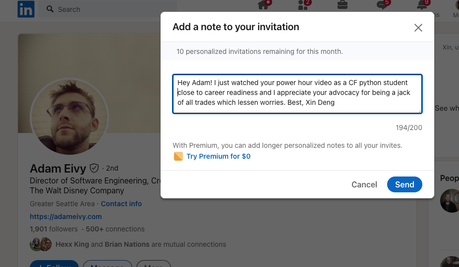

# Class 15 - Trees, Job Search Workshop

## Lab 15 - Tree Implementation

## Setup

## Code Challenge

Overview
[Read this overview.](https://codefellows.github.io/code-301-guide/curriculum/class-01/challenges/)

Video
[Watch the video for this class from the demo playlist.](https://www.youtube.com/playlist?list=PLVngfM2hsbi-L6G8qlWd8RyRbuTamHt3k)

Demonstration
[Look through these sample problems.](https://codefellows.github.io/code-301-guide/curriculum/class-01/challenges/DEMO.html)

Challenges

1. Navigate to the javascript folder within your data-structures-and-algorithms repository.
2. Create a new branch for this challenge called for-each
   git checkout -b for-each
3. Retrieve the code challenge from the system
   npm run get-challenge 01
4. In your terminal, from the javascript folder, run npm test 01 to execute the tests in this file for this challenge.
5. At this point you will see the failed tests scroll through your terminal window with a brief report of the number of failed tests at the bottom.
6. If you do not see this, verify your installation of Jest by typing npx jest --version in your terminal. Filename typos can make things break!
7. Write code to make the tests pass, one at a time. Let the error messages guide you.
8. Once the test is passing, refactor as needed, then move on to the next challenge.
9. Note, you can also run npm test (without a challenge number) to run all of the tests for every code challenge file assignment during the course all at once. This can get “noisy”, but it’s an opportunity to get a view of your overall progress

Submission
When you have completed the entire set of code challenges and all tests pass, create a pull request from your current branch to the main branch and merge it into main.

You will be able to see a test coverage report in GitHub on the Actions tab of your data-structures-and-algorithms repository. It should match what you saw on your terminal in the above steps. Your graders will be looking at this as well.

Submit a link to your pull request.

## Written Class Notes

## Read 15 - Tree Implementation

## Resources Link/Pages

- [Trees](https://codefellows.github.io/common_curriculum/data_structures_and_algorithms/Code_401/class-15/resources/Trees.html)

## Answer

To turn in your reading “Reply” to this discussion by teaching something that you learned. Then review what one of your classmates learned, and leave a comment.

Some ideas for how you might want to teach:

- Use an analogy
- Explain a detail in depth
- Use WHY, WHAT, HOW structure
- Tutorial / walk through an example
- Write a quiz
- Create a vocabulary/definition list
- Write a cheat sheet
- Create a diagram / visualization / cartoon of a topic
- Anthropomorphize the concepts, and write a conversation between them
- Build a map of the information
- Construct a fill-in-the-blank worksheet for the topic

### Vocabulary/Definition List for Linked Lists

1. **Trees:**

   - **Definition:** A hierarchical data structure composed of nodes, where each node has a value and references to other nodes.
   - **Analogy:** Think of a family tree where each person is a node, and relationships (edges) connect parents to children.

2. **Node:** A component in a tree containing values and references.
3. **Root:** The starting node of the tree.
4. **K** - A number that specifies the maximum number of children any node may have in a k-ary tree. In a binary tree, `k = 2`.
5. **Left** - A reference to one child node, in a binary tree
6. **Right** - A reference to the other child node, in a binary tree
7. **Leaf:** A node without any children.
8. **Edge:** The link between a parent and child node.
9. **Height:** The number of edges from the root to the furthest leaf.

10. **Traversals:**

    - **Definition:** The process of visiting nodes in a specific order.
    - **Analogy:** Navigating through a library by either exploring shelves from left to right (Breadth First) or going deep into each aisle (Depth First).

11. **Depth First:**

    - **Definition:** Traversal prioritizing the depth (height) of the tree first.
    - **Analogy:** Exploring a maze by choosing paths that go deeper before exploring other branches.

12. **Breadth First:**

    - **Definition:** Traversal iterating through each level of the tree.
    - **Analogy:** Searching a building floor by floor, covering all rooms on one level before moving to the next.

13. **Binary Tree Vs K-ary Trees:**

    - **Definition:** Binary Tree restricts nodes to have at most two children, while K-ary Trees allow more than two.
    - **Analogy:** Binary is like a road intersection with only left and right turns, while K-ary is like an intersection allowing multiple directions.

14. **Binary Search Trees:**

    - **Definition:** A type of tree where values smaller than the root go left, and larger go right.
    - **Analogy:** Organizing a bookshelf where books with titles starting with A-L are on the left and M-Z are on the right.

15. **Searching a BST:**
    - **Definition:** Locating a specific value in a Binary Search Tree.
    - **Analogy:** Finding a word in a well-organized dictionary by comparing and narrowing down sections.

## Learning Journal

### Reflection

Take 10-15 minutes at the end of lab to respond to the following questions, adapted from the article:

1. What went well, that I might forget if I don’t write down?
   - I understood the stack and queue challenge better than other code challenges I've ever done. Using the linked list as a template helped a lot and I just sorta figured out how to configure things to be used for stack and queue
2. What did I learn today?
   - I learned how to shorten my personal pitch which I had trouble before, and it didn't sound like I was reading from an essay
3. What should I do differently next time?
   - I need to use Fridays more efficiently as catch up or prep for next week to make sure my fridays aren't' swamped with HW
4. What still puzzles me, or what do I need to learn more about?
   - I still don't get how to efficiently write code to pass tests, it takes so long, feel like its efficient to just start writing code.
5. Thinking about each of your assignments for the day, reflect on:
   - Is the assignment complete? If not, where exactly did you leave off, and what work remains?
     - I need help on lab 8 so will get help on that today

## Career 15 - Partner Power Hour - Report #3

> If there is no live presentation on campus in this module, select the appropriate presentation from the list below. All presenters are open to connections and invite you to reach out to them, so that you can to learn more about them, their company, and the industry.
> You may find it difficult or challenging to connect with industry professionals and gain an inside look at how the tech world operates. We’ve drawn on our network to bring you speakers and topics relevant to this stage of your career transition. These presentations may serve to educate, enlighten, and motivate you along your journey. Take advantage of this opportunity, and make the most of the insights these presentations provide… you never know where a connection will lead.

[Breaking Down the Tech Interview w/Rover - Rover Engineering Team](https://youtu.be/_6Fi8FFvdQs)
[Whiteboarding Tips & Strategies - Roger Huba](https://youtu.be/aDL3403Q6xY)
[Automate Yourself Out of a Job - Adam Eivy](https://youtu.be/2VJV-zNCtF8)
[Communication Under Stress - Eve Denison](https://youtu.be/K0fnB3ygcm4)
[Deep dive - Dev Tools - David Souther](https://youtu.be/nGNQCisfj8Q)
[CI/CD History Lesson - Kat Cosgrove](https://youtu.be/_Md_NTWNgOE)
[The 7 C’s of Cybersecurity & Coding - Courtney Hans](https://youtu.be/GqRDGi4ta5U)
[Your Net Worth - John Cokos](https://youtu.be/Qu-_1b3xYGQ)

> Automate Yourself Out of a Job - Adam Eivy

1. Share one or two ways the speaker’s information will change your approach to your career transition.

   - Advocates for being a "Jack of All Trades" in tech.
   - Highlights the value of having a broad skill set for a holistic understanding.
   - Encourages examining past code for continuous improvement.
   - Demonstrating growth and adaptability through self-reflection.

1. List a few key take-aways from this presentation.

   - **Automation Principles:**

     - Prioritizes automating daily tasks for efficiency.
     - Advocates for integrating automation into the routine.

   - **Customization Benefits:**

     - Stresses the importance of tailoring automation tools.
     - Customization enhances effectiveness by aligning with individual preferences.

   - **User-Centric Approach:**

     - Promotes learning from user experiences and feedback.
     - Encourages iterative improvement based on real-world interactions.

   - **Startup Strategies for Success:**

     - Highlights the significance of early product-market fit tests.
     - Emphasizes direct engagement with end-users for authentic feedback.

   - **Customer-Driven Automation:**

     - Suggests building automation based on personal needs.
     - Recommends continuous testing with a genuine customer to ensure relevance.

   - **Insights from User Interactions:**

     - Warns against working in isolation without user input.
     - Encourages understanding user nuances for effective product development.

   - **Versatility as a Strength:**

     - Advocates for being a "Jack of All Trades" in tech.
     - Highlights the value of having a broad skill set for a holistic understanding.

   - **Strategies for Career Growth:**

     - Recommends learning from on-the-job experiences.
     - Identifying and addressing inefficiencies within the team contributes to growth.

   - **Networking and Marketability Tactics:**

     - Emphasizes engagement with recruiters and industry professionals.
     - Building an online portfolio, especially on GitHub, for showcasing skills.

   - **Reflective Learning:**
     - Encourages examining past code for continuous improvement.
     - Demonstrating growth and adaptability through self-reflection.

1. Share a screenshot of your LinkedIn connection request, including a nicely worded note, sent to the speaker or someone else at their company.
   

## Career 15 - Workshop #3: Job Searches, Networking, and Negotiations
