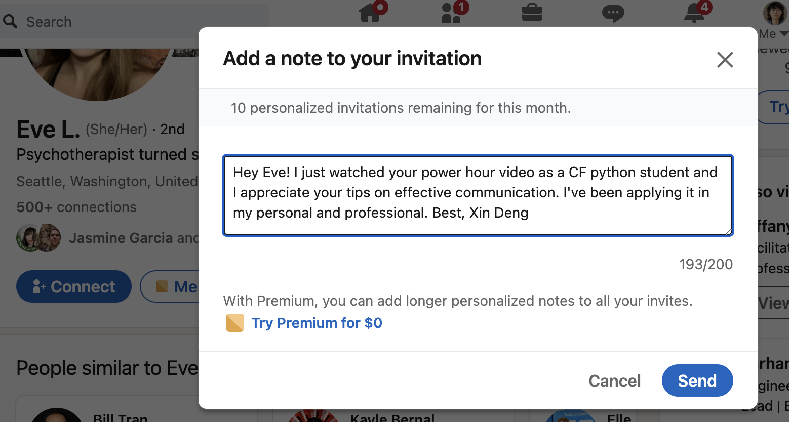

# Class 20 - Project Kickoffs

## Lab 20 - Team Setup, Ideation, Wireframes, Tooling

### Overview - Chess Board

Today we’ll be constructing chess boards like it’s 1980.

No prebuilt images, just the power of arrays and pixel art.

### Feature Tasks and Requirements

1. Your job is to render out chess boards with red and blue queens on them.

2. We’re keeping it really basic here so the only pieces are queens and each queen is represented by a blue or red square.

3. Chess board is an 8 by 8 grid of alternating black and white squares. The queens are red and blue squares.

4. Each board will have one red and one blue queen at different coordinates. In addition to displaying the board you’ll need to identify if the queens are “under attack” based on their coordinates.

### Implementation Notes

- Define a ChessBoard class

- Should contain an 8x8 grid.

  - Each cell in the grid should have a color represented in RGB format.
    - Black: (0, 0, 0)
    - White: (1, 1, 1)
    - Blue: (0, 1, 1)
    - Red: (1, 0.2, 0)

- Should have an `add_red` method that accepts a row and column as input which colors the corresponding cell.
- Should have an `add_blue` method that accepts a row and column as input which colors the corresponding cell.
- Should have a `render` method that displays the chess board on the screen with red and blue shown in correct locations.
- Should have an `is_under_attack` method that returns a boolean if red is under attack by a blue piece horizontally, vertically, or diagonally.
- Diagonal attacks can come from four directions. Make sure to handle all of them.

- Render your board for each `is_under_attack` scenario:

  1. Horizontal (aka same row).
  2. Vertical (aka same column).
  3. Four Diagonals.
  4. A "Not Under Attack" scenario.

### User Acceptance Tests

There are no acceptance tests required. The notebook should clearly show that the various `is_under_attack` scenarios have been handled.

## Code Challenge

- **Branch Name:** stack-queue-pseudo
- **Challenge Type:** Code Challenge / Algorithm

### Feature Tasks

Implement a Queue using two Stacks.

1. Create a new class called pseudo queue.
2. Do not use an existing Queue.
3. Instead, this PseudoQueue class will implement our standard queue interface (the two methods listed below),
4. Internally, utilize 2 Stack instances to create and manage the queue

- `enqueue`

  - **Arguments:** value
  - Inserts a value into the PseudoQueue, using a first-in, first-out approach.

- `dequeue`
  - **Arguments:** none
  - Extracts a value from the PseudoQueue, using a first-in, first-out approach.

**NOTE:** The Stack instances have only push, pop, and peek methods. You should use your own Stack implementation. Instantiate these Stack objects in your PseudoQueue constructor.

### Example

```python
# Example
queue = PseudoQueue()
queue.enqueue(5)
queue.enqueue(10)
queue.enqueue(15)
value = queue.dequeue() # Output: 5
```

#### Enqueue

| Input            | Args | Internal State        |
| ---------------- | ---- | --------------------- |
| [10]->[15]->[20] | 5    | [5]->[10]->[15]->[20] |
|                  | 5    | [5]                   |

#### Dequeue

| Input                 | Output | Internal State  |
| --------------------- | ------ | --------------- |
| [5]->[10]->[15]->[20] | 20     | [5]->[10]->[15] |
| [5]->[10]->[15]       | 15     | [5]->[10]       |

## Written Class Notes


## Read 20 - None

## Resources Link/Pages


## Things I want to know more about


## Learning Journal

### Reflection

Take 10-15 minutes at the end of lab to respond to the following questions, adapted from the article:

1. What went well, that I might forget if I don’t write down?
    - I liked learning the career stuff today, but I forgot to write most of it down so will rewatch recording later to take notes again.
2. What did I learn today?
    - No matter the skills you have most of your chances of getting hired is through networking, which I don't know how to do well so that's going to be such a challenge. 
3. What should I do differently next time?
    - Take screenshots of the slides.
4. What still puzzles me, or what do I need to learn more about?
    - I'm not understanding trees like I did stacks and queues so I will look at it more.
5. Thinking about each of your assignments for the day, reflect on:
   - Is the assignment complete? If not, where exactly did you leave off, and what work remains?
      - Assignments are complete. Will work on readings for next week. 

## Career 20 - Partner Power Hour - Report #4

> If there is no live presentation on campus in this module, select the appropriate presentation from the list below. All presenters are open to connections and invite you to reach out to them, so that you can to learn more about them, their company, and the industry.
> You may find it difficult or challenging to connect with industry professionals and gain an inside look at how the tech world operates. We’ve drawn on our network to bring you speakers and topics relevant to this stage of your career transition. These presentations may serve to educate, enlighten, and motivate you along your journey. Take advantage of this opportunity, and make the most of the insights these presentations provide… you never know where a connection will lead.

[Breaking Down the Tech Interview w/Rover - Rover Engineering Team](https://youtu.be/_6Fi8FFvdQs)
[Whiteboarding Tips & Strategies - Roger Huba](https://youtu.be/aDL3403Q6xY)
[Automate Yourself Out of a Job - Adam Eivy](https://youtu.be/2VJV-zNCtF8)
[Communication Under Stress - Eve Denison](https://youtu.be/K0fnB3ygcm4)
[Deep dive - Dev Tools - David Souther](https://youtu.be/nGNQCisfj8Q)
[CI/CD History Lesson - Kat Cosgrove](https://youtu.be/_Md_NTWNgOE)
[The 7 C’s of Cybersecurity & Coding - Courtney Hans](https://youtu.be/GqRDGi4ta5U)
[Your Net Worth - John Cokos](https://youtu.be/Qu-_1b3xYGQ)

> Communication Under Stress - Eve Denison

1. Share one or two ways the speaker’s information will change your approach to your career transition.

    - If you’re already bracing yourself for things to go badly, you project an energy that’s not going to be effective in conversation. I do this a lot because I tend to see things realistically and I guess there’s a fine line between realistic and pessimistic.
    - It's acceptable to teach others how to communicate with you effectively, for example “If you need feedback, I respond well like this…” Really good advice, but remember to teach in an effective way too.


1. List a few key take-aways from this presentation.

    - Strong emotions put different parts of your brain in the driver seat trying to get different things you want.
    - Assumptions pose a significant obstacle to effective communication.
    - In writing, there's a risk of losing much in translation, leading to ineffective communication.
    - Acknowledge personal triggers from life, as they accompany us to work and school, impacting interactions.
    - Regularly check your general well-being; it's acceptable to have a bad day, but it's often neglected due to busyness.
    - If you’re already bracing yourself for things to go badly, you project an energy that’s not going to be effective in conversation
    - Differentiate between not getting what you want and not being heard to avoid confusion.
    - When stressed in communication, take a pause to ensure you respond from a non-reactive part of the brain.
    - Assess the urgency before responding immediately; not every situation requires an immediate reply.
    - Utilize the "and over but" technique to acknowledge achievements and consider additional steps.
    - It's acceptable to teach others how to communicate with you effectively, for example “If you need feedback, I respond well like this…”


1. Share a screenshot of your LinkedIn connection request, including a nicely worded note, sent to the speaker or someone else at their company.
   
