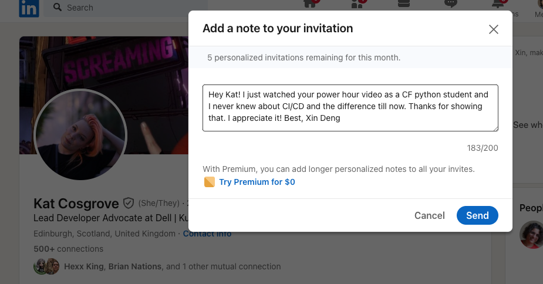

# Class 30 - Hash Tables, Behavioral Interviewing

## Lab 30 - Hash Tables Implementation

## Setup

## Code Challenge

- **Branch Name:** trees
- **Challenge Type:** New Implementation

### Features

Implement a Hashtable Class with the following methods:

1. set
   - Arguments: key, value
   - Returns: nothing
   - This method should hash the key, and set the key and value pair in the table, handling collisions as needed.
   - Should a given key already exist, replace its value from the value argument given to this method.
2. get
   - Arguments: key
   - Returns: Value associated with that key in the table
3. has
   - Arguments: key
   - Returns: Boolean, indicating if the key exists in the table already.
4. keys
   - Returns: Collection of keys
5. hash
   - Arguments: key
   - Returns: Index in the collection for that key

## Written Class Notes

## Read 30 - Hash Table Implementation

## Resources Link/Pages

- [Intro to Hash Tables](https://codefellows.github.io/common_curriculum/data_structures_and_algorithms/Code_401/class-30/resources/Hashtables.html)
- [What is a hash table](https://www.youtube.com/watch?v=MfhjkfocRR0)
- [Basics of hash tables](https://www.hackerearth.com/practice/data-structures/hash-tables/basics-of-hash-tables/tutorial/)
- [Hash table wiki](https://en.wikipedia.org/wiki/Hash_table)

## Answer

To turn in your reading “Reply” to this discussion by teaching something that you learned. Then review what one of your classmates learned, and leave a comment.

Some ideas for how you might want to teach:

- Use an analogy
- Explain a detail in depth
- Use WHY, WHAT, HOW structure
- Tutorial / walk through an example
- Write a quiz
- Create a vocabulary/definition list
- Write a cheat sheet
- Create a diagram / visualization / cartoon of a topic
- Anthropomorphize the concepts, and write a conversation between them
- Build a map of the information
- Construct a fill-in-the-blank worksheet for the topic

### Vocabulary/Definition List for Hashtables

1. **Hashtable:**

   - **Definition:** A data structure that uses a hash function to map keys to indexes in an array, allowing for efficient retrieval of values associated with those keys.
   - **Analogy:** Think of a library where books are organized based on a unique code assigned to each book, making it easy to locate a book quickly.

2. **Buckets:**

   - **Definition:** Containers within the hashtable array, each holding key/value pairs. An index in the array corresponds to a bucket.
   - **Analogy:** Visualize each shelf in a library representing a bucket, with books (key/value pairs) placed on the shelf based on their assigned codes.

3. **Collisions:**

   - **Definition:** Occurs when two or more keys hash to the same index in the array, requiring a mechanism to handle and store multiple key/value pairs at that index.
   - **Analogy:** In our library, if two books have the same code, a librarian needs to manage both books on the same shelf.

4. **Hash Function:**

   - **Definition:** An algorithm that takes a key and returns a hash, ensuring deterministic output based on the input and allowing for efficient indexing.
   - **Analogy:** Think of a magical formula that converts a person's name into a unique code consistently.

5. **Load Factor:**

   - **Definition:** The ratio of the number of stored key/value pairs to the total number of buckets in the hashtable, indicating how full or sparse the hashtable is.
   - **Analogy:** Like determining how full a suitcase is concerning its total capacity.

6. **Method:**

   - **Definition:** A function or routine associated with the hashtable, such as set(), get(), has(), and keys().
   - **Analogy:** Think of actions you can perform in a library, like borrowing a book, returning a book, or checking if a book is available.

7. **Linked List:**

   - **Definition:** A data structure that can be used to handle collisions by creating a chain of nodes within a bucket.
   - **Analogy:** If a shelf in the library is full, a linked list acts like an additional shelf, accommodating more books.

8. **set():**

   - **Definition:** Adds a new key/value pair to the hashtable, utilizing the hash function to determine the appropriate index.
   - **Analogy:** Like placing a new book on the library shelf, ensuring it's in the right location based on its code.

9. **get():**

   - **Definition:** Retrieves the value associated with a given key by calculating the hash and navigating to the corresponding index.
   - **Analogy:** Similar to finding a specific book on the library shelf using its assigned code.

10. **has():**

    - **Definition:** Checks if a key exists in the hashtable by using the hash function and verifying the presence of the key at the calculated index.
    - **Analogy:** Performing a quick check in the library catalog to see if a particular book is available.

11. **keys():**

    - **Definition:** Returns a collection of unique keys in the hashtable, allowing for a comprehensive view of all stored keys.
    - **Analogy:** Imagine a list of all the unique codes assigned to books in the library, providing an overview of available items.

12. **hash():**

    - **Definition:** Accepts a key, applies the hash function, and returns the index where the key/value pair should be placed in the array.
    - **Analogy:** Similar to the process of generating a unique code for a book based on its title.

## Learning Journal

### Reflection

Take 10-15 minutes at the end of lab to respond to the following questions, adapted from the article:

1. What went well, that I might forget if I don’t write down?
   - I liked learning the career stuff today, but I forgot to write most of it down so will rewatch recording later to take notes again.
2. What did I learn today?
   - No matter the skills you have most of your chances of getting hired is through networking, which I don't know how to do well so that's going to be such a challenge.
3. What should I do differently next time?
   - Take screenshots of the slides.
4. What still puzzles me, or what do I need to learn more about?
   - I'm not understanding trees like I did stacks and queues so I will look at it more.
5. Thinking about each of your assignments for the day, reflect on:
   - Is the assignment complete? If not, where exactly did you leave off, and what work remains?
     - Assignments are complete. Will work on readings for next week.

## Career 30 - Partner Power Hour - Report #6

> If there is no live presentation on campus in this module, select the appropriate presentation from the list below. All presenters are open to connections and invite you to reach out to them, so that you can to learn more about them, their company, and the industry.
> You may find it difficult or challenging to connect with industry professionals and gain an inside look at how the tech world operates. We’ve drawn on our network to bring you speakers and topics relevant to this stage of your career transition. These presentations may serve to educate, enlighten, and motivate you along your journey. Take advantage of this opportunity, and make the most of the insights these presentations provide… you never know where a connection will lead.

1. [Breaking Down the Tech Interview w/Rover - Rover Engineering Team](https://youtu.be/_6Fi8FFvdQs)
2. [Whiteboarding Tips & Strategies - Roger Huba](https://youtu.be/aDL3403Q6xY)
3. [Automate Yourself Out of a Job - Adam Eivy](https://youtu.be/2VJV-zNCtF8)
4. [Communication Under Stress - Eve Denison](https://youtu.be/K0fnB3ygcm4)
5. [Deep dive - Dev Tools - David Souther](https://youtu.be/nGNQCisfj8Q)
6. [CI/CD History Lesson - Kat Cosgrove](https://youtu.be/_Md_NTWNgOE)
7. [The 7 C’s of Cybersecurity & Coding - Courtney Hans](https://youtu.be/GqRDGi4ta5U)
8. [Your Net Worth - John Cokos](https://youtu.be/Qu-_1b3xYGQ)

> CI/CD History Lesson - Kat Cosgrove

1. Share one or two ways the speaker’s information will change your approach to your career transition.

   - Avoid Manual Updates: Manual updates of servers can lead to catastrophic failures. Definitely will try to avoid if possible.
   - Catastrophic failures in tech are often the result of process failures, not individual mistakes. May come in handy to remember in the future.

1. List a few key take-aways from this presentation.

   - Continuous Integration and Continuous Deployment (CI/CD):

     - CI/CD is a methodology and toolset designed to increase development speed and efficiency.
     - Automates tasks like building, testing, and deploying software.

   - Avoid Manual Updates:

     - Manual updates of servers can lead to catastrophic failures.
     - Example: Knight Capital lost $440 million and went out of business due to a bad manual update.

   - Blame the Process, Not the Individual:

     - Catastrophic failures in tech are often the result of process failures, not individual mistakes.
     - Engineers should not be blamed for systemic issues.

   - Security and CI/CD:

     - CI/CD facilitates quick responses to security issues.
     - Fast updates and patches reduce vulnerability to security breaches.

   - Handling Flaky Integration Tests:

     - Flakes are a reality; sometimes, re-running is the solution.
     - Disable or investigate consistently failing tests.

   - Getting into Developer Advocacy:
     - No need to be an expert; even newbies can contribute valuable perspectives.
     - Start by talking at conferences or meetups; it's a great way to network and gain visibility.
     - Some conferences cover travel and accommodation costs for speakers.

1. Share a screenshot of your LinkedIn connection request, including a nicely worded note, sent to the speaker or someone else at their company.
   

## Career 30 - Workshop #4: Mock Interviews
