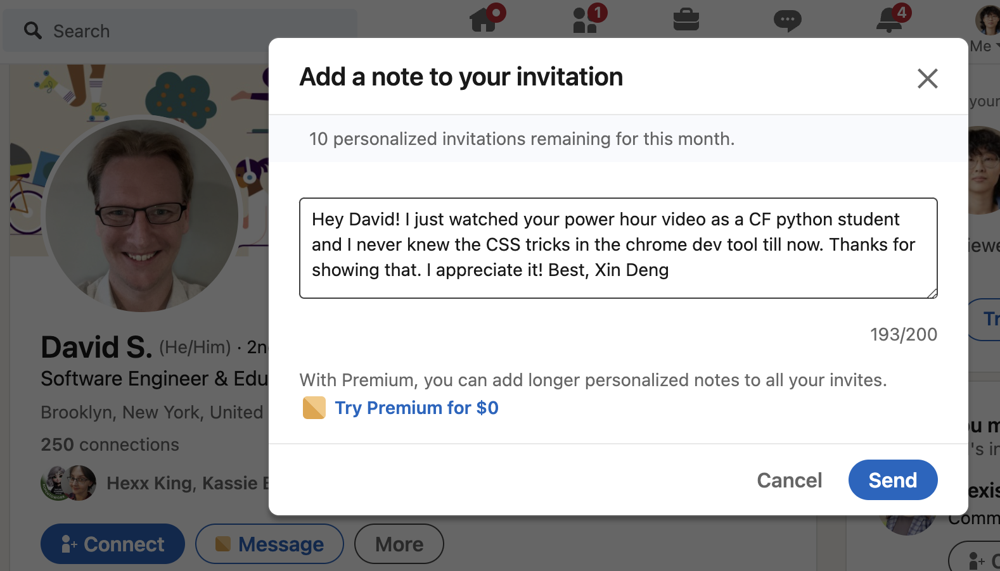

# Class 35 - Graphs, Technical Interviewing

## Lab 35 - Graph Implementation

## Setup

## Code Challenge

- **Branch Name:** graph
- **Challenge Type:** New Implementation

### Features

Implement your own Graph. The graph should be represented as an adjacency list, and should include the following methods:

1. add vertex
   - Arguments: value
   - Returns: The added vertex
   - Add a vertex to the graph
2. add edge
   - Arguments: 2 vertices to be connected by the edge, weight (optional)
   - Returns: nothing
   - Adds a new edge between two vertices in the graph
   - If specified, assign a weight to the edge
   - Both vertices should already be in the Graph
3. get vertices
   - Arguments: none
   - Returns all of the vertices in the graph as a collection (set, list, or similar)
   - Empty collection returned if there are no vertices
4. get neighbors
   - Arguments: vertex
   - Returns a collection of edges connected to the given vertex - Include the weight of the connection in the returned collection
   - Empty collection returned if there are no vertices
5. size
   - Arguments: none
   - Returns the total number of vertices in the graph
   - 0 if there are none

## Written Class Notes

## Read 30 - Hash Table Implementation

## Resources Link/Pages

- [Graphs](https://codefellows.github.io/common_curriculum/data_structures_and_algorithms/Code_401/class-35/resources/graphs.html)

## Answer

To turn in your reading “Reply” to this discussion by teaching something that you learned. Then review what one of your classmates learned, and leave a comment.

Some ideas for how you might want to teach:

- Use an analogy
- Explain a detail in depth
- Use WHY, WHAT, HOW structure
- Tutorial / walk through an example
- Write a quiz
- Create a vocabulary/definition list
- Write a cheat sheet
- Create a diagram / visualization / cartoon of a topic
- Anthropomorphize the concepts, and write a conversation between them
- Build a map of the information
- Construct a fill-in-the-blank worksheet for the topic

### Vocabulary/Definition List for Graphs

1. **Graph:**

   - **Definition:** A non-linear data structure consisting of vertices (nodes) and edges that connect these vertices.
   - **Analogy:** Imagine a city map where locations are represented by nodes, and roads connecting these locations are represented by edges.

2. **Vertex:**

   - **Definition:** Also known as a node, it's a data object within a graph that can have connections to other vertices.
   - **Analogy:** Think of each intersection in a city as a vertex, representing a specific location.

3. **Edge:**

   - **Definition:** A connection between two vertices/nodes in a graph.
   - **Analogy:** Roads or pathways connecting different intersections in a city represent edges in a graph.

4. **Neighbor:**

   - **Definition:** The adjacent vertices/nodes of a given vertex, connected to it via edges.
   - **Analogy:** Buildings or landmarks neighboring each intersection on a city map represent neighbors in a graph.

5. **Degree:**

   - **Definition:** The number of edges connected to a vertex in a graph.
   - **Analogy:** The number of roads leading out from an intersection in a city represents the degree of that intersection.

6. **Undirected Graph:**

   - **Definition:** A type of graph where edges have no direction, meaning they represent connections between vertices that are bidirectional.
   - **Analogy:** Imagine a network of roads where each road allows traffic to flow in both directions, resembling the undirected connections between locations on a city map.

7. **Directed Graph:**

   - **Definition:** Also called a Digraph, it's a graph where every edge has a specific direction.
   - **Analogy:** Think of one-way streets in a city map, where each road has a designated direction of travel.

8. **Complete Graph:**

   - **Definition:** A graph where every pair of distinct vertices is connected by a unique edge.
   - **Analogy:** In a complete city map, every location is directly accessible from any other location via a road.

9. **Connected Graph:**

   - **Definition:** A graph where every vertex has at least one edge, ensuring connectivity across the graph.
   - **Analogy:** Imagine a city where you can reach any location from any other location through a series of roads.

10. **Disconnected Graph:**

    - **Definition:** A graph where some vertices may not have edges, resulting in isolated components within the graph.
    - **Analogy:** Visualize separate neighborhoods in a city with limited or no direct connections between them.

11. **Acyclic Graph:**

    - **Definition:** A directed graph without any cycles or loops.
    - **Analogy:** Think of a road network where it's impossible to travel in a loop without retracing any path.

12. **Cyclic Graph:**

    - **Definition:** A graph that contains one or more cycles, allowing traversal back to the starting vertex.
    - **Analogy:** Visualize a road network with routes that lead back to the starting point, forming loops or circuits.

13. **Adjacency Matrix:**

    - **Definition:** A 2-dimensional array representation of a graph where rows and columns represent vertices, and cells indicate edge connections.
    - **Analogy:** Imagine a grid-like map showing direct connections between different locations in a city.

14. **Adjacency List:**

    - **Definition:** A collection of linked lists or arrays that lists all vertices connected to each vertex in a graph.
    - **Analogy:** Think of a list of neighboring locations for each intersection on a city map, indicating direct connections.

15. **Weighted Graph:**

    - **Definition:** A graph where each edge has an associated numerical value or weight.
    - **Analogy:** Consider a city map where roads have different lengths or travel times, representing the weighted connections between locations.

16. **Breadth-First Traversal:**

    - **Definition:** A graph traversal algorithm that visits all vertices at the same level before moving to the next level. Use queues.
    - **Analogy:** Like exploring all locations within a city block before moving to adjacent blocks.

17. **Depth-First Traversal:**

    - **Definition:** A graph traversal algorithm that explores as far as possible along each branch before backtracking. Use stacks.
    - **Analogy:** Imagine navigating through interconnected streets in a city, exploring each path fully before moving to the next one.

18. **Sparse Graph:**

    - **Definition:** A graph where few edges connect vertices, resulting in a lower density of connections.
    - **Analogy:** Visualize a city with widely dispersed neighborhoods and limited direct routes between them.

19. **Dense Graph:**

    - **Definition:** A graph where many edges connect vertices, resulting in a higher density of connections.
    - **Analogy:** Think of a bustling urban area with numerous interconnected streets and pathways between locations.

## Retrospective

Retrospectives are a critical part of Agile, and typically take the form of meetings held by a team at the end of a sprint cycle. To get us acclimated to that process, we will use the format of a retrospectives to guide today’s reflection.

This [article](https://www.benlinders.com/2013/which-questions-do-you-ask-in-retrospectives/) gives a nice overview to the role of retrospectives.

1. What went well, that I might forget if I don’t write down?
2. What did I learn today?
3. What should I do differently next time?
4. What still puzzles me, or what do I need to learn more about?
5. Thinking about each of your assignments for the day, reflect on:
   - Is the assignment complete? If not, where exactly did you leave off, and what work remains?
   - Do not get bogged down in written analysis; instead, focus on capturing the moment with an eye toward how your observations can guide you toward future productivity.

## Career 35 - Partner Power Hour - Report #7

> If there is no live presentation on campus in this module, select the appropriate presentation from the list below. All presenters are open to connections and invite you to reach out to them, so that you can to learn more about them, their company, and the industry.
> You may find it difficult or challenging to connect with industry professionals and gain an inside look at how the tech world operates. We’ve drawn on our network to bring you speakers and topics relevant to this stage of your career transition. These presentations may serve to educate, enlighten, and motivate you along your journey. Take advantage of this opportunity, and make the most of the insights these presentations provide… you never know where a connection will lead.

1. [Breaking Down the Tech Interview w/Rover - Rover Engineering Team](https://youtu.be/_6Fi8FFvdQs)
2. [Whiteboarding Tips & Strategies - Roger Huba](https://youtu.be/aDL3403Q6xY)
3. [Automate Yourself Out of a Job - Adam Eivy](https://youtu.be/2VJV-zNCtF8)
4. [Communication Under Stress - Eve Denison](https://youtu.be/K0fnB3ygcm4)
5. [Deep dive - Dev Tools - David Souther](https://youtu.be/nGNQCisfj8Q)
6. [CI/CD History Lesson - Kat Cosgrove](https://youtu.be/_Md_NTWNgOE)
7. [The 7 C’s of Cybersecurity & Coding - Courtney Hans](https://youtu.be/GqRDGi4ta5U)
8. [Your Net Worth - John Cokos](https://youtu.be/Qu-_1b3xYGQ)

> Deep dive - Dev Tools - David Souther

1. Share one or two ways the speaker’s information will change your approach to your career transition.

   - I never knew this trick so it’s cool to know now but clicking the plus button to add a CSS change, click inspector stylesheet to look at all CSS changes you made, copy and paste into CSS file or else all changes disappear after refresh
   - Will look into chrome devtools blog for more tips

1. List a few key take-aways from this presentation.

   - Click plus button, inspector stylesheet to look at CSS changes you made, copy and paste into CSS file or else all changes disappear after refresh
   - Console log tips: write a string to detail what the log is for. console.log statements with multiple parameters for effective debugging.
   - Too much logging makes it difficult to identify issues. Switch to using breakpoints for better debugging.
   - Suggested exploring the "Chrome DevTools What's New" blog for the latest updates. Recommended searching for tutorials and videos to learn specific features.

1. Share a screenshot of your LinkedIn connection request, including a nicely worded note, sent to the speaker or someone else at their company.
   
