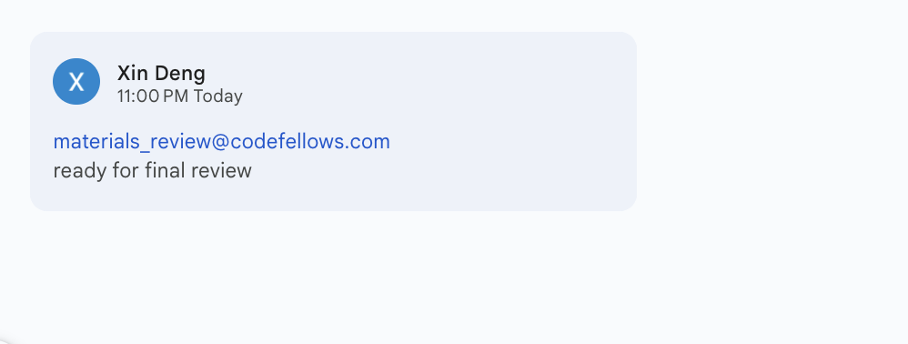

# Class 45 - Project Kickoffs

## Lab 45 - Team Setup, Ideation, Wireframes, Tooling

## Setup

## Code Challenge

## Written Class Notes

## Read 41 - React 4

## Retrospective

Retrospectives are a critical part of Agile, and typically take the form of meetings held by a team at the end of a sprint cycle. To get us acclimated to that process, we will use the format of a retrospectives to guide today’s reflection.

This [article](https://www.benlinders.com/2013/which-questions-do-you-ask-in-retrospectives/) gives a nice overview to the role of retrospectives.

1. What went well, that I might forget if I don’t write down?
2. What did I learn today?
3. What should I do differently next time?
4. What still puzzles me, or what do I need to learn more about?
5. Thinking about each of your assignments for the day, reflect on:
   - Is the assignment complete? If not, where exactly did you leave off, and what work remains?
   - Do not get bogged down in written analysis; instead, focus on capturing the moment with an eye toward how your observations can guide you toward future productivity.

## Career 35 - Partner Power Hour - Report #9

> If there is no live presentation on campus in this module, select the appropriate presentation from the list below. All presenters are open to connections and invite you to reach out to them, so that you can to learn more about them, their company, and the industry.
> You may find it difficult or challenging to connect with industry professionals and gain an inside look at how the tech world operates. We’ve drawn on our network to bring you speakers and topics relevant to this stage of your career transition. These presentations may serve to educate, enlighten, and motivate you along your journey. Take advantage of this opportunity, and make the most of the insights these presentations provide… you never know where a connection will lead.

[Breaking Down the Tech Interview w/Rover - Rover Engineering Team](https://youtu.be/_6Fi8FFvdQs)
[Whiteboarding Tips & Strategies - Roger Huba](https://youtu.be/aDL3403Q6xY)
[Automate Yourself Out of a Job - Adam Eivy](https://youtu.be/2VJV-zNCtF8)
[Communication Under Stress - Eve Denison](https://youtu.be/K0fnB3ygcm4)
[Deep dive - Dev Tools - David Souther](https://youtu.be/nGNQCisfj8Q)
[CI/CD History Lesson - Kat Cosgrove](https://youtu.be/_Md_NTWNgOE)
[The 7 C’s of Cybersecurity & Coding - Courtney Hans](https://youtu.be/GqRDGi4ta5U)
[Your Net Worth - John Cokos](https://youtu.be/Qu-_1b3xYGQ)

> Your Net Worth - John Cokos

1. Share one or two ways the speaker’s information will change your approach to your career transition.

   - I think I need to learn that taking risks can lead to valuable learning experiences and personal growth. This career transition is a big risk but I’m still learning something and if I can make this work then I’ve made it work.
   - I need to be more confident in myself and my abilities. I need to bet on myself more and increase my bet because maybe I am worth a lot more than why I’ve conditioned myself to think.

1. List a few key take-aways from this presentation.

   - If you think it's valuable and you want to get a different level of customers you got to charge more for it
   - You decide what you're worth
   - We put ourselves under pressure
   - Bet on yourself
   - You're betting on yourself not on your ability to write code

1. Share a screenshot of your LinkedIn connection request, including a nicely worded note, sent to the speaker or someone else at their company.

## Career 45 -  CAP: Finalize Your Materials

