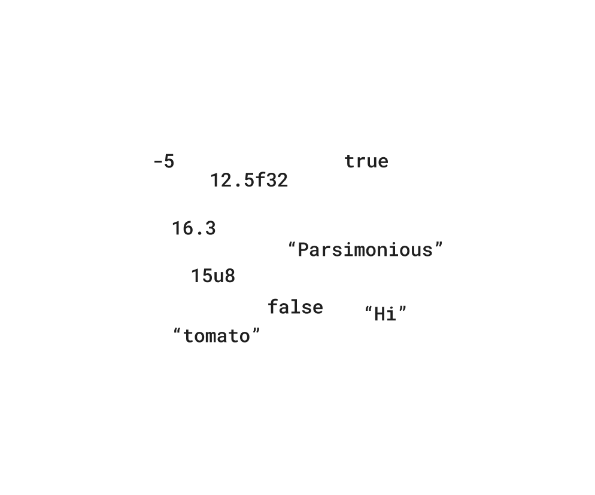

# Drawing Data Structures

## Part two of a series on technical whiteboarding.

Visual communication is a valuable but often overlooked skill in software development. This guide provides a set of useful ways to draw common data structures and values. These can be used in any number of settings. They are especially useful when creating test cases, developing how an algorithm could solve a problem, and when stepping through code that relies heavily on data structures.

### Primitives

Numbers are written as numbers. For languages that distinguish between integer and floating point, it is easiest to write the number with a decimal `.` for floating point and without for integer. Alternatively, the size, if necessary, can be part of the number itself, like `12.5f32` or `15u8` for a 32-bit floating point and an 8-bit unsigned integer, respectively.

Strings are written with surrounding quotes, when they are short and when their structure isn’t critical to the algorithm at hand. Otherwise, they can be treated as objects and written to the right of the table, as shown below.

Boolean values are written as `true` and `false`. (Or `True` / `False` in Python.)

Several numbers, strings, and boolean values.

### Lists

Small, constant lists (three or fewer values that don’t change) can be written inline with three horizontal boxes.

Larger lists should be written with a set of boxes adjacent to one another. Additional boxes can be added as the list grows.

Values inside the boxes for each list index are drawn as primitives, or as arrows to other lists and objects.

Linked Lists can be drawn as squares or circles with their value inside (either primitive or arrow from the middle to another value), and a line from the edge to the “next” node in the list. Nodes with a “null” next value can point at empty space, or elide their next arrow entirely. For problems where the value isn’t important, only the structure, use the color of the circle to signify differing values.

An array of prime numbers. A list of famous book opening lines. A linked list with 4 nodes.

### Trees

Similar to linked lists, tree nodes are boxes or circles with their values in the middle and arrows from the edge to another node.

Binary trees should have two arrows out of the bottom, for left and right. A missing left or right can either point to an empty area or be elided entirely.

N-Array trees can point to an intermediate child list, if the structure of the list is important, or simply have N arrows to child nodes out of the parent node.

DOM Trees can be drawn with nested boxes, showing the nesting structure of the DOM tags.

A binary tree with depth 3 and 6 nodes. An N-ary tree with depth 3 and 7 nodes. A DOM structure with body, header, nav, main, and footer.

### Objects

Objects, or key/value pairs, should always be drawn on the heap.

An object is a box with a T Table inside it. The names are the properties of the object, and the values are those properties’ values, in the same format as other values. The Name / Value header can be elided, but above the box, the class the object was created from should be written (if applicable).

It is not necessary to draw the methods or functional properties of an object; however, in a typed language, it can be helpful to write the type of the object above the card.

A Person object with information about the author. Several Room objects, with the connections from the hallway to its adjacent rooms.

### Summary

While there is no single “correct” way to draw any data structure, drawing it consistently is important for clear communication. These recommendations are a set that has worked well in a variety of educational and professional settings.
