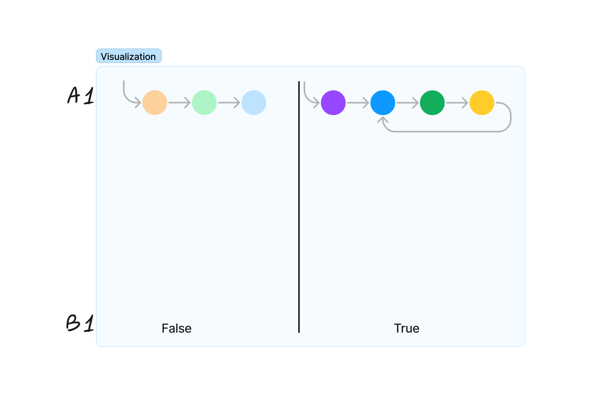
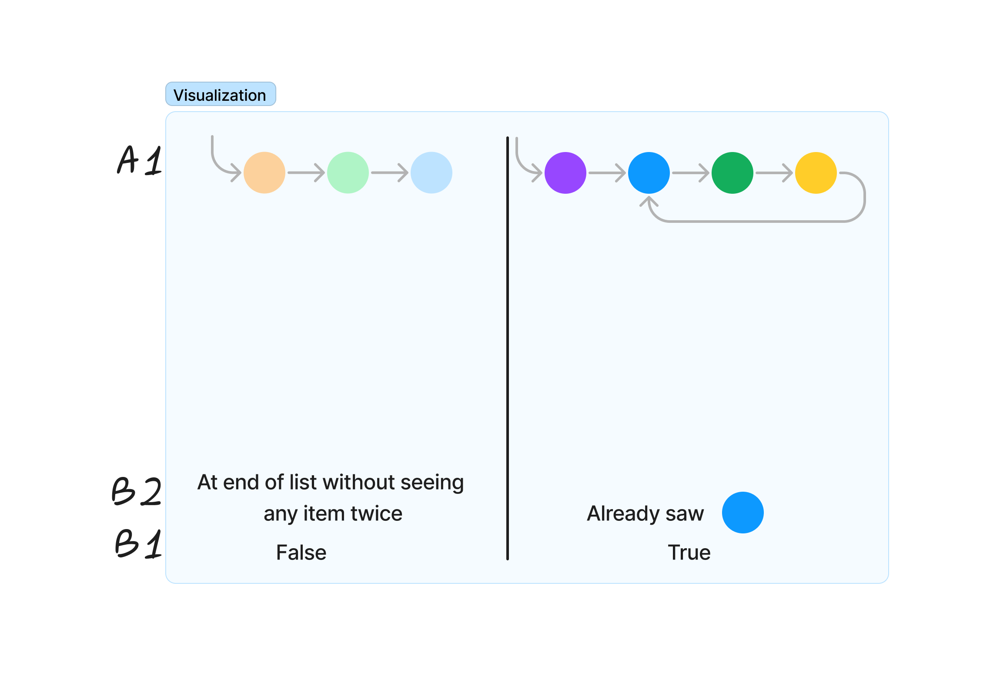
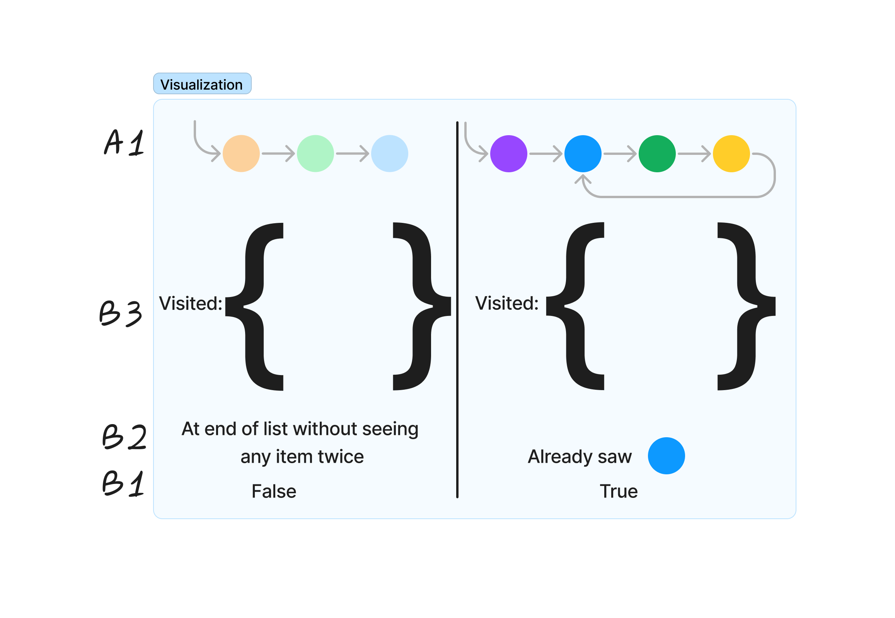
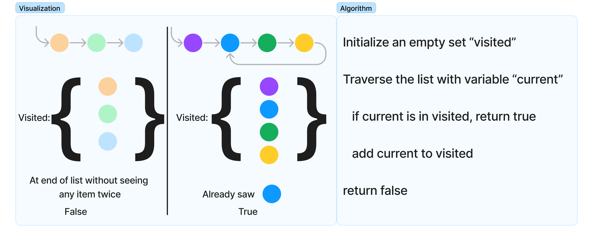

# The Forward/Backward Method for Developing Algorithms

## Part three of a series on technical whiteboarding.

Developing an algorithm for an unknown, novel programming problem can be a daunting task. The Forward/Backward method is a consistent, repeatable approach that guides a developer towards a correct & robust solution. It begins with brainstorming two or three specific test case datasets for the problem.

This example develops an algorithm to detect whether a linked list has a cycle. A cycle happens when a node links “back” earlier in the list. Here, the programmer has created two linked lists, one with and one without a cycle. Visually it is easy to see the cycle as the arrow that goes back to earlier in the first example, and the absence of such an arrow in the second.

The forward/backward process is a problem-solving technique to break a large problem into a series of smaller steps. It begins by working from the bottom up, or backward. Start by drawing the inputs at the top of the working area, and the output at the bottom. If the inputs and output are containers with a generic data type, prefer to draw them using shapes and colors rather than making up specific words or numbers.

The inputs and outputs have been written at the top and bottom, respectively, and labeled A1 forward and B1 backward. The programmer then asks, “what information did I use to decide on the values false and true?”

After this drawing, the output for a test case is at the bottom of the visualization and the input is at the top. Call the output B1 and the input A1. Looking at the output, ask what is the immediate precursor information necessary to find that value. This Key Question drives much of the forward/backward process - “What is the immediate piece of information that gives this data” when working backward, and “what information can I immediately derive, generate, or fill in” moving forward.

The first answer to the question “What information did I use to decide on the values false and true?” was that the arrow “points” backward. Unfortunately, the “direction” of an arrow isn’t part of the definition of a linked list, which only includes the “next” pointer but not where that goes in relation to the current node. However, the programmer notices that a traversal of the linked list would have already seen the blue node in the example on the right; on the left, it would have completed and only seen each node once. This answer to the question fills in step B2.

For example, if the output is a boolean value, the immediate precursor operation is a comparison. Draw the two values and how they were compared. Or if the output is a list, notate the change that created the output, and draw the list in its previous state directly above B1. This precursor to the output step B1 is step B2. Repeat this process. In the comparison example, where did the two values come from? If it was a change to a data structure, where did the information for the change come from? Draw the source of those values as step B3.

Applying the key question again, “what information did I use to get this data?”, the programmer recognizes they used a set to track which nodes had and had not been seen. This set structure is B3.

After some number of steps working backwards, an intermediate data structure should become apparent that provides the information needed to work forwards to B1. Now, work forwards from A1 to this intermediate step. Describe the creation of the data structure, any loops necessary to convert the input to that, and any additional information that might be needed or useful. These forward steps are A2, A3, etc.

Having moved backwards to needing a visited set data structure, the programmer observes “What information can I fill in?”, the forward key question, is the visited set found in step B3. A traversal of the list, storing each item in the set, is forward step A2. At this point, there is a complete thread of logic and small steps from A1 (the input), to A2 (filling in a visited list during a traversal) to B3 (checking the visited list during the traversal), to B2 (seeing (or not seeing) a duplicate item, to B1, returning immediately when a duplicate is seen, or when the traversal has completed.

When the forward and backward steps line up in the visualization using specific values, it’s time to write a general plain language description of each step. These steps should not be specific to any programming language. They should use “big picture” holistic operations, like “traverse the list”, “compare the values”, or “check the set”. Calling out intermediate data structures by variable name is appropriate, but describing the changes to a loop variable i is too detailed for a general algorithm.

This write-up describes the forward and backward steps in an algorithmic way. It doesn’t deal with details of the function name or argument variables, but does call out specific names for the set and the traversal variable for the set. It uses concise If statements, and generic operations on the intermediate data structures.

This approach to problem solving works best with a good understanding and recognition of the common data structures, their methods, and the algorithms to work on. While any problem may need specific domain knowledge, generally, knowing how to construct and traverse arrays, linked lists, binary trees, n-ary child trees, and hashmaps, as well as how stacks, queues, and sets augment traversals for those structures, is a solid starting point.

### Recursive Algorithms

A problem may have a very clear recursive solution. When the problem can be rephrased as “Do the same operation on two parts of the input”, or “do the operation on the head, and then repeat”, it might be amenable to recursion. Recursion requires two pieces: the base case, and the operation. Identify the base case (usually either empty or one item in the data structure), the recursion on one or more parts of the data structure, and any logic necessary to combine those results.

In recursion, the empty case becomes critical to identify, as this case (and possibly the one or two item case) will come to define the base case of the recursion. Failure to identify the base case at this time will greatly increase the difficulty in the remainder of the interview.
