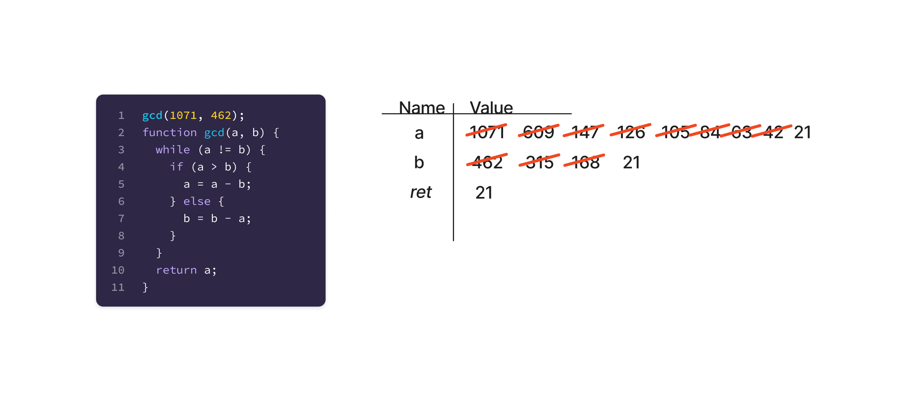
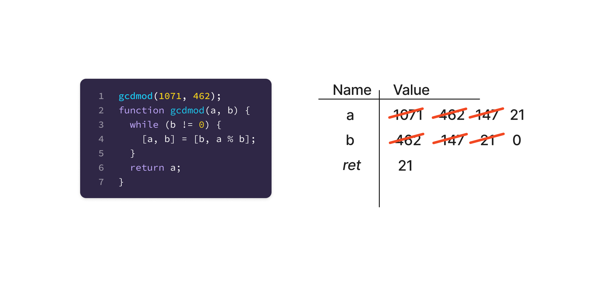
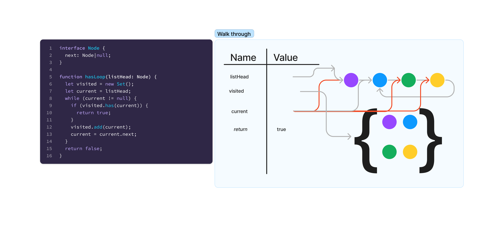
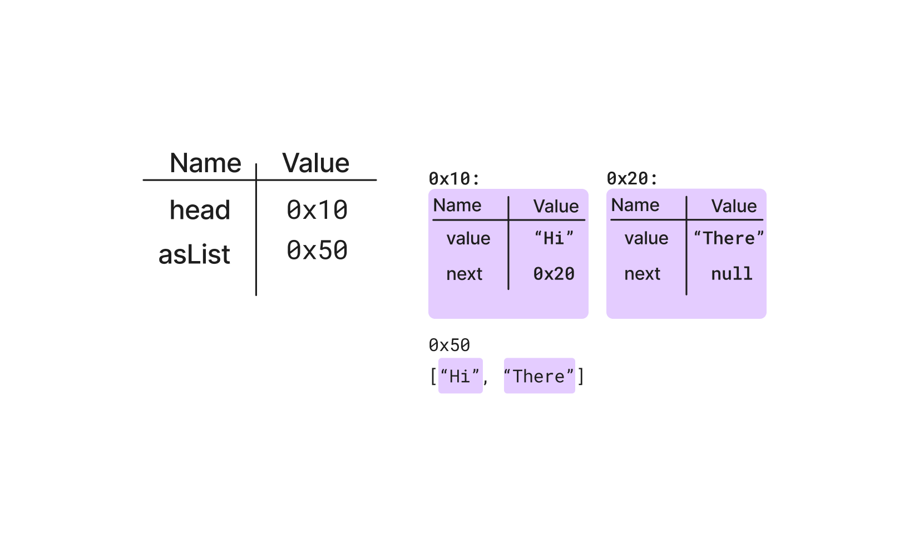
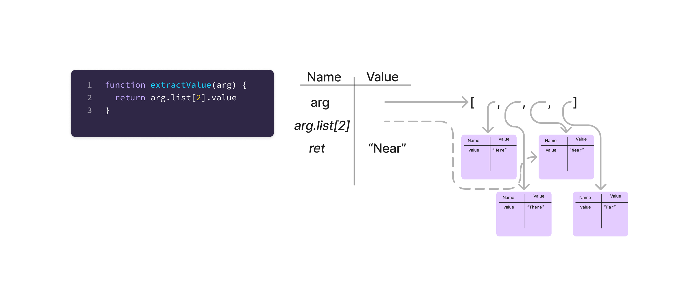
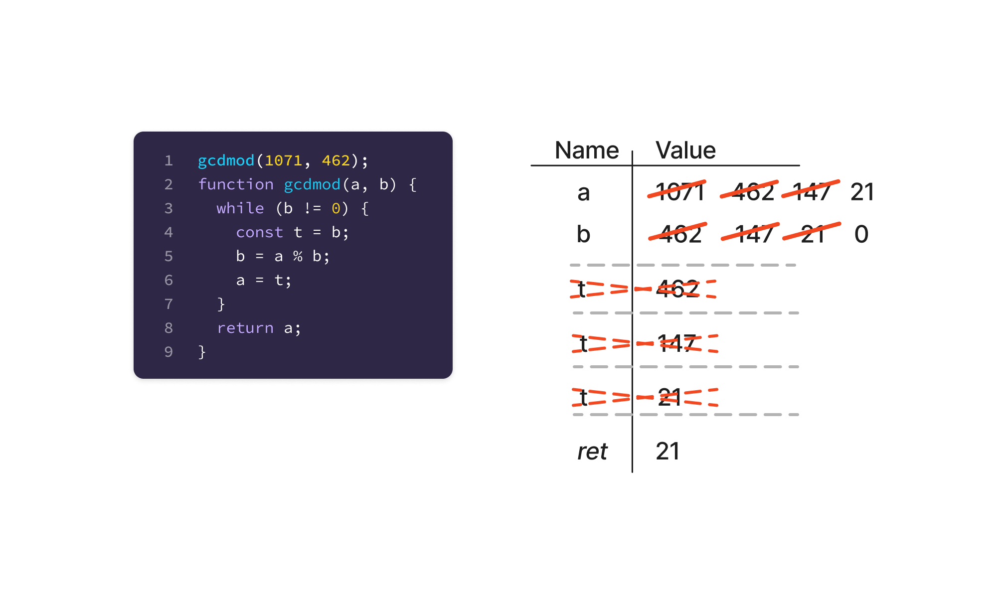

# Tracing Code

## Part four of a series on technical whiteboarding.

Tracing code is a tool to execute code on pen & paper (or, without running it on a computer). As a learning tool, tracing by hand with pen & paper drives a deeper understanding of programming. In practice, it is a quick and easy mechanism to evaluate and explore the implications of certain programming patterns. Developing this skill improves the abilities of a programmer in many areas.

While there are many possible ways to trace the behavior of code with pen and paper, the approach described here has been validated in a number of scenarios as being clear, extensible, and productive in meeting educational goals.

## Name/Value Table

Tracing starts with a print out of the code to work through. Without code, there’s nothing to trace! With the code available, create a T table of names on the left and values on the right.

This is a completed trace of calling a Greatest Common Divisor (GCD) function. The GCD function computes the largest integer that is itself a divisor of two other integers. This approach using repeated subtraction is known as “Euclid’s Algorithm”. It has two variables, `a` and `b`, which both have numeric values that change repeatedly over the course of executing the function. Each of those intermediate values is captured in the table, less as reference and more as a tool to keep attention & not lose a value.

Read through the code, parsing each statement and expression.

1. **Check variable names in the table.**
   If the code has a variable name on the left hand side of an `=` assignment operator, check for the name in the table. If the line declares the variable and the name is in the table, that is an error.

   Look for each variable in the right hand side of the `=`, or the condition of the control flow. If the name for the right hand side variables are not in the table, that is an error.

2. **Evaluate expressions.**
   Look up variable names in the table, and copy their values.

   For objects and arrays, follow `.` and `[]` for properties and indexes. Perform arithmetic, and apply functions to arguments.

3. **On lines that have an assignment operator `=`, update variables in the table.**
   Ensure the variable on the left of the `=` is already in the table. Evaluate the expression on the right of the `=`. Cross out the last value in the table. Write or draw the new value from the evaluated expression.

This version of GCD uses the “Long Division” improvement to Euclid’s algorithm, resulting in many fewer iterations. It also uses the JavaScript argument spread syntax, to avoid creating an intermediate variable inside the while loop.

4. **Follow control flow.**
   Function calls for code that has been written in this solution should be traced. See Function Calls, below.

   If statements execute the body when the condition is true, or the else body if the condition is false and the else is present. If conditions that don’t result in a boolean may or may not be an error, depending on the language. Depending on which side, note that next line and repeat.

   While loops check the condition. If the condition is true, they execute the next line in the body. Otherwise, they execute the next line after the end of the body.

   For loops come in several flavors, but generally work as a while loop with an additional assignment. Depending on the flavor of the for loop, the assignment will happen after the body has run, or as part of a “has next item / get next item” operation pair. See languages for specifics.

5. **Where there is no control flow, move to the next line and repeat until finished!**

## State

The core purpose of this tracing technique is to understand how program state changes over time. To make this readily apparent, this approach does not erase prior values. Instead, this approach crosses out those values, so that on review, it is apparent how they changed over the course of a program. It becomes immediately visually apparent to the reader (and more importantly, the tracer) which variables change, any patterns to their change, and any exceptions to the expected pattern.

Primitive values (booleans, numbers, short strings, and small arrays with three items or fewer) should be drawn directly in the value column. Complex values, primarily objects and large arrays of more than three items, should be drawn to the right of the name/value table with an arrow from the value pointing at the object. If a property or array entry itself has a complex value, draw another arrow. In the visual step through, arrows are literal pointer references. When the pointer value changes, either scribble out the arrow or change its color to represent it is the “old state”, and draw a new arrow to the updated value.

This walk through of a circular linked list detection algorithm shows a number of arrows for objects. The `listHead` doesn’t actually point to an object but points to the reference that is the head of the passed-in linked list. Each node then has a color to represent its value and an arrow for its next pointer. This could also be drawn as a name/value table, but because Linked List nodes are well known, they have a streamlined representation. The yellow node has a next arrow pointing back to blue, forming the circle. The visited set, like the list nodes, uses a shorthand notation wrapping copies of the nodes in curly braces (their next pointers would technically be set but are elided for clarity). The current node moved several times through the algorithm, with old positions colored red. At the end of the fourth loop iteration, the arrow from current to the blue node was red, and the arrow from current to the yellow node was gray.

## Function Calls

Some function calls or method invocations do not need to be traced. Library methods that have a well-known interface can be evaluated and their result used in an expression. However, functions and methods that are part of the solution being traced should be represented on the table of variables.

When tracing a function call, draw a horizontal line across the table (leaving some space for future variables in the current function). To the left of the name column, write the function’s name. If the function is a method, the first variable should be `this` (self, in Python) and point to the appropriate object in the heap. Add the argument variables, as normal, and continue tracing the function.

When returning from a function, add a final entry in the name column as `return` (or `ret`), with the return value in the value column. Draw an arrow along the left side of the stack back to the variable the return value is assigned to. Copy this value (or arrow) to that value slot. Finally, cross out with a large X the completed function invocation.

A recursive implementation of the GCD algorithm. Each recursive call received a new stack frame (the horizontal lines), with the two arguments. As the functions returned, the arrow filled in the return value for the prior invocation and the frame got crossed off as “complete”.

## Extensions

### Fewer Arrows with Heap Pointers

Instead of arrows to the heap, each heap object can have a “memory address” assigned. These should be chosen pseudo-randomly and always written in hexadecimal. For

the object or list in the heap, write its fake address to the top left of the visualization and put the same number in the value column for the pointer variable. Arrows are optional - they will reinforce what the pointer values are, and they make it obvious to see when an object is no longer in use (all arrows pointing to it are crossed out), but they may be over cluttering for some pointer-heavy programs.

A good rule of thumb for pointers is to start at 0x10, incrementing the first hex digit by one for each new object, and incrementing the second digit by 1 for each field or item in the array. This does imply a limit of 16 items in an array or 16 fields in a struct and does imply word-aligned member access.

### Expression Evaluation as Variables

Programmers with complex expressions may want to track those computations during execution. Adding an expression to the T-table where the left column is the expression of interest, and the right column is its value, is a convenient way to track these pieces of information.

The `extractValue` function looks at the value of the item at index 2 in the `list` property of `arg`. In the table, `arg.list[2]` is shown in the “name” column and makes it clear which object is at index 2 in the array. The `return` entry can skip the process of going through the entire expression and follow the arrow directly.

### Scope

Many languages have block scopes for variables. In Java, scopes are created at any pair of braces. JavaScript creates scopes at any pair of control flow braces (for `let` and `const` variables). In either case, variables defined within the scope are no longer valid after the scope.

When tracing a function that has a scope block, draw a dashed line instead of a solid line when starting the scope. Continue the trace as normal, using all values both in the function and the local scope. When the scope is complete, cross it off the same as exiting a function. Multiple scopes can be stacked, and read values higher up the stack.

A while loop that uses a temporary variable `t` to swap values between `a` and `b`. This temporary variable is created inside the body of a while loop and so goes out of scope at the end of the body (before the loop evaluates for its next execution).
