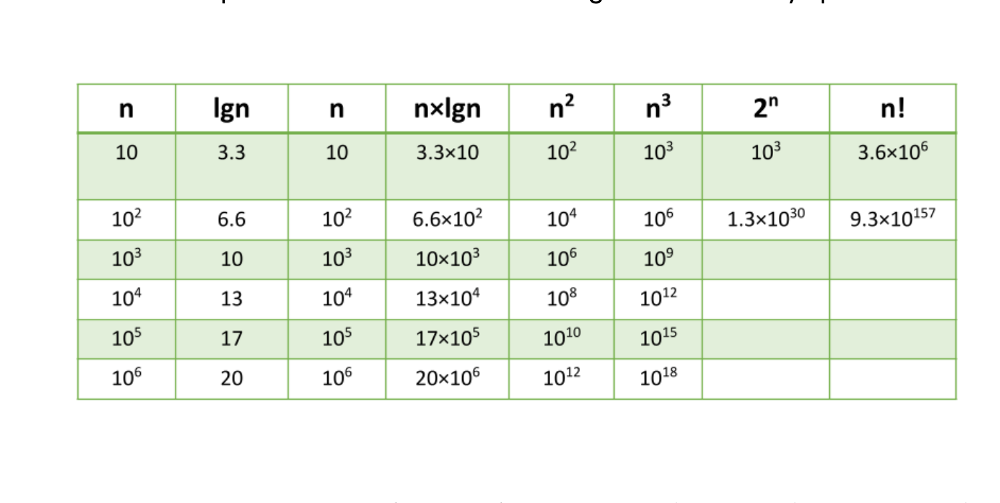
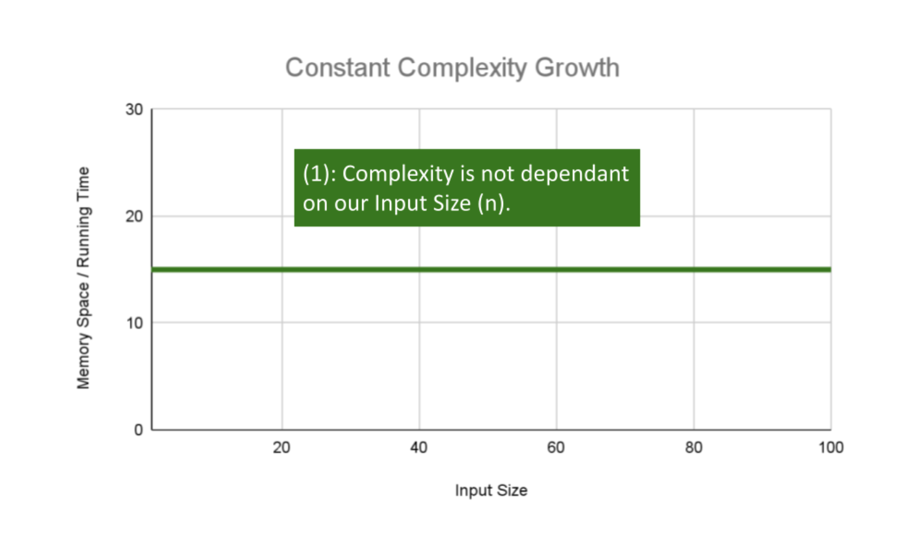
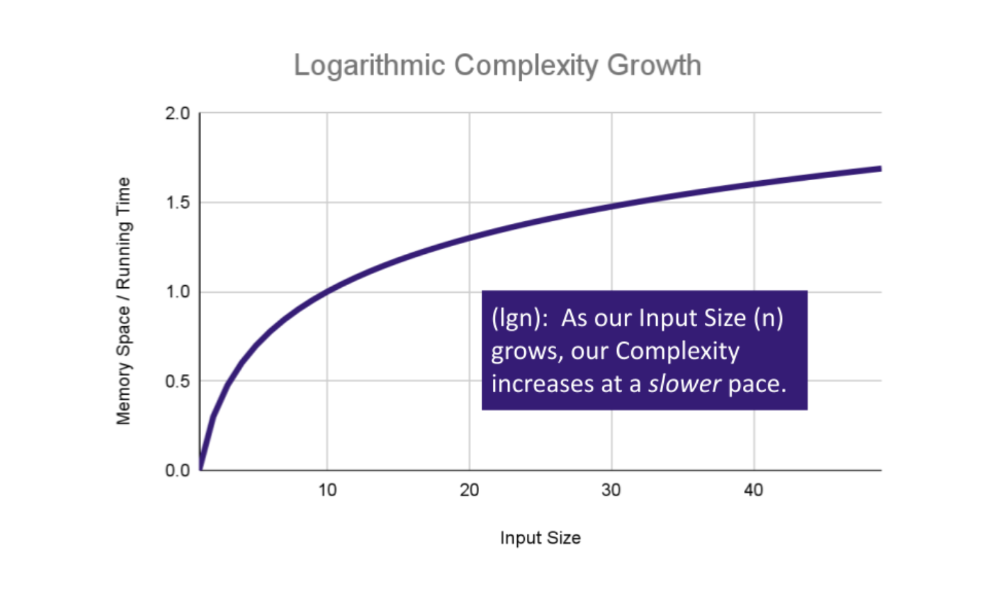
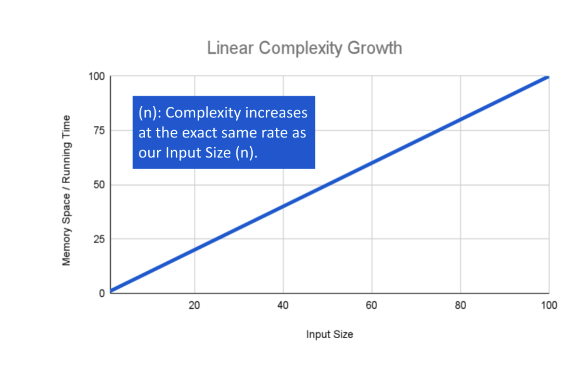
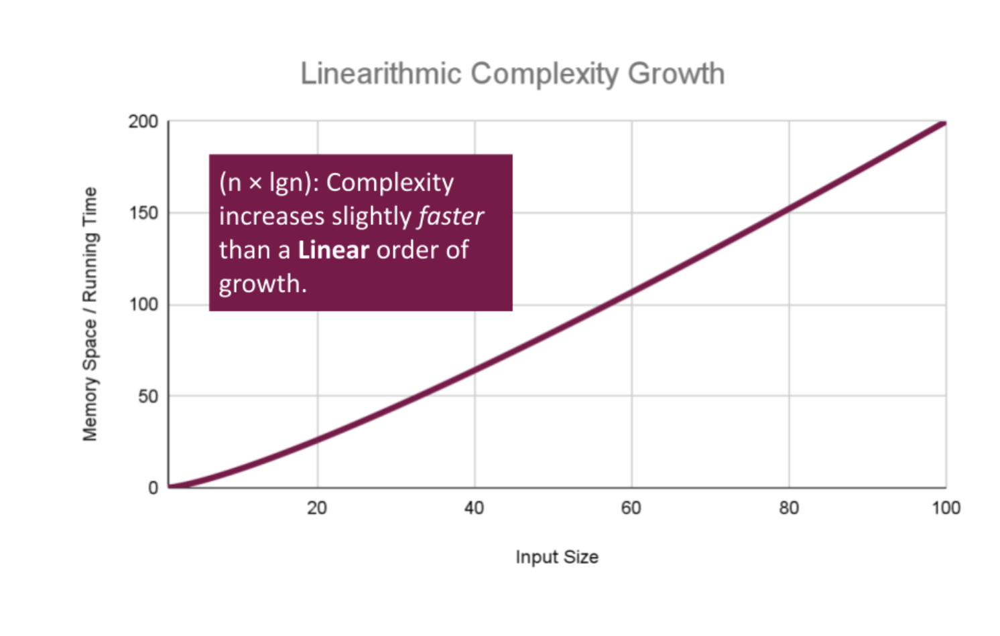
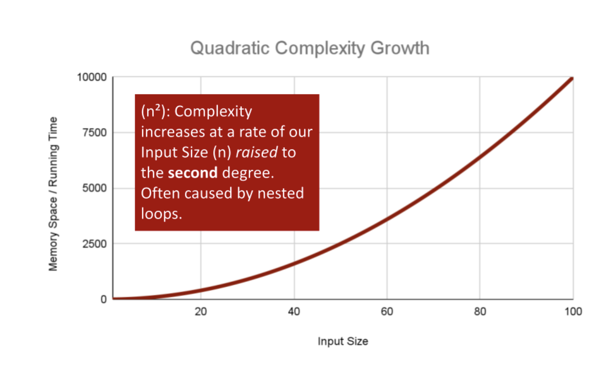
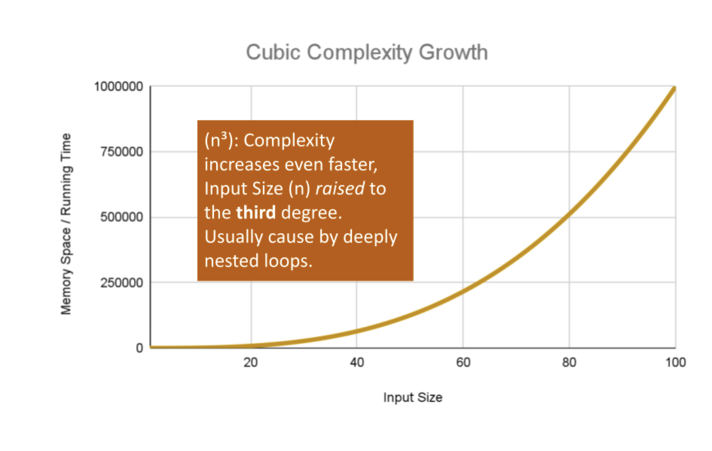
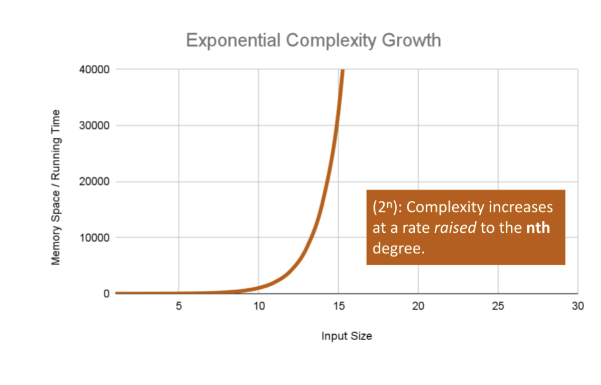
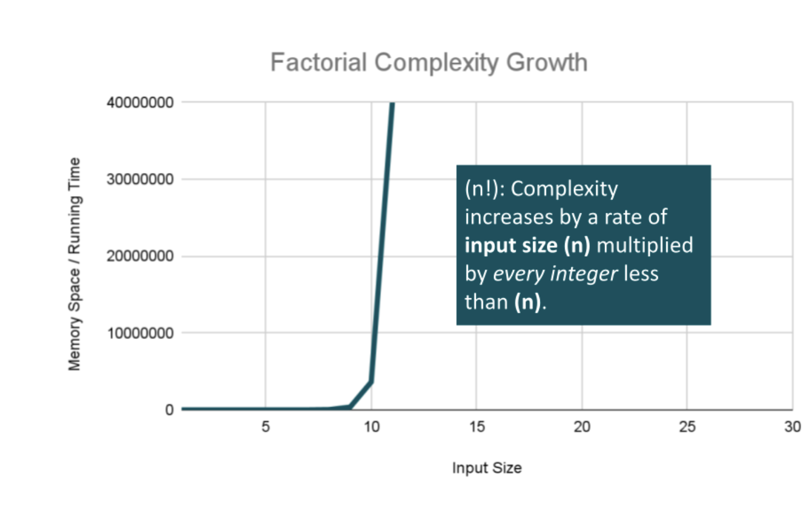
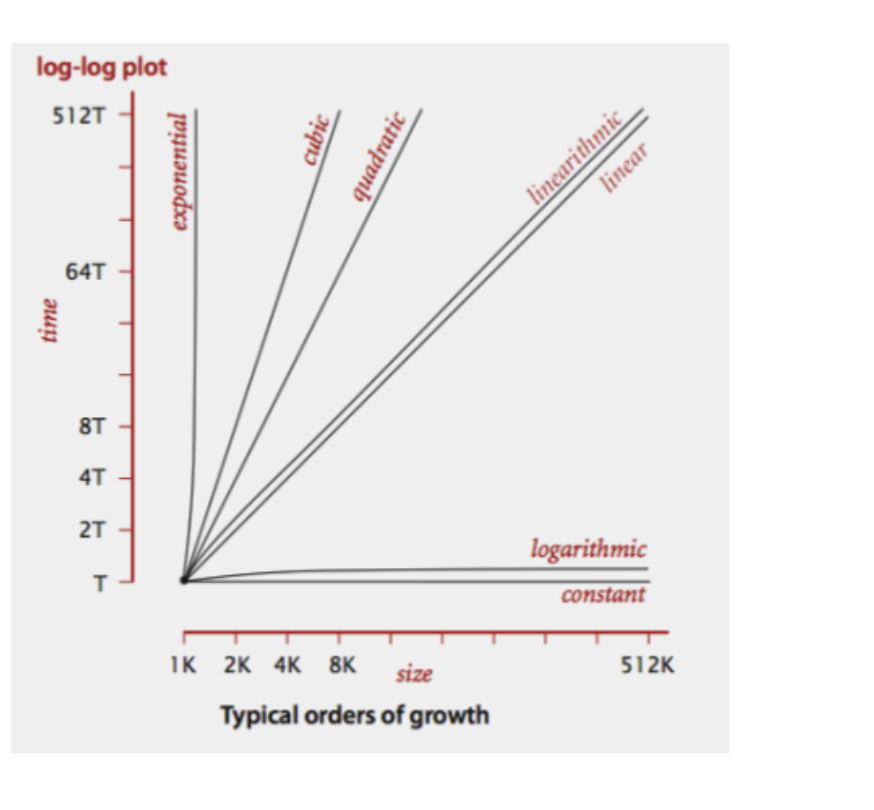

# Analyzing Algorithms

## Part five of a series on technical whiteboarding.

Big-O Analysis describes the behavior of the algorithm as the input dataset grows large. While the datasets on the whiteboard are never large enough to be a concern for running on a modern machine, tracing an O(N^2) algorithm when an O(NlogN) solution was available for a 5-item input is the difference between 12 loops and 25. Big-O analysis assigns a complexity category to each operation in the algorithm; however, some complexity can be hidden in standard library calls. Therefore, a completed Big-O can only be done after the code is written & debugged. It is still useful to establish an expected or lower bound for Big-O during the development of the algorithm to compare trade-offs.

Big-O analysis looks at an abstract notion of “time”, that is, the number of operations needed to complete in proportion to the number of input items, and “space”, that is, the amount of additional memory needed beyond the memory used by the input data. Briefly, a traversal of an array or list of input is O(N) in time. A second traversal over the entire data set inside of the router loop would make it O(N^2), and a third traversal inside the second makes it O(N^3). Operating over a constrained portion of the data, like a binary search, would be O(log N). Space complexity is O(1) if only primitive data is tracked for the problem; O(N) if a copy of the data is made, and larger for some additional cases.

Using the Tracing Code approach can give a very good explanation of time and size complexity. If a certain line is traced a number of times, or a certain piece of data updated a number of times, that can show whether the time complexity is O(n) or worse. Size complexity is apparent from the number of boxes drawn in the heap area of the program - if there’s a copy of each item of the input data, it must be O(n).


## Calculating Efficiency

Performing a step-through or trace of an algorithm with an input of about a dozen items can give a pretty good estimate for the time and space complexity of a problem. If the step through only looks at each item once, it’s safe to say the algorithm is O(n). This looks like a single line of values on the trace. If it’s a rectangle or square of values, that is probably `O(n^2)`. And an algorithm where the trace breaks the input in half is probably `O(log n)`.

Calculating space and time efficiency from code is a little bit more complicated. Start by looking at every line of code that isn’t a loop. If it’s a simple operation, mark the line as as `O(1)`. This line is constant time, meaning that changing the size of data won’t change how long this line takes to run. If the line is a function call, look up (or calculate) the time complexity of that function, and mark the line with that complexity. If the line of code cuts the data set in half, that line is `O(log n)`. (For instance, in merge sort or binary search when moving the index by `(max - min) / 2).`

Next, look at loops. If the loop, as most loops do, uses the length of the data, the loop iteration is `O(n)`, that is, adding more items means the loop has that much more to do. Within each loop, find the line with the largest big-O. Now, multiply the` O(n) `of the loop iteration with the Big-O of the body. The loop as a whole has this combined Big-O. If there are additional loops, calculate the same for them. If a loop is inside another loop, repeat this process as well, but use the inner loop’s Big-O as the multiplier for the outer loop.

When finished, the function will have the Big-O of the biggest O of the top lines (usually the deepest loop).

Analyzing memory (space) complexity looks at allocations to a data structure - pushing to an array, inserting into a map, or similar. Notate any line that stores a piece of data for a period of time. When a line only does a calculation or assignment, it’s O(0) space. If the line allocates a new array, the line has O(1) if the size is fixed or O(n) if the size is calculated from the incoming data. Methods and functions are evaluated the same as with time, substituting the Big-O of the function for the line. Then, apply the same multiplication process for loops - if the loop is O(n), and there is an O(n) allocation, the overall size is O(n^2).

### Orders of Growth

We can describe overall efficiency by using the input size n and measuring the overall Units of Space and Time required for the given input size n. As the value of n grows, the Order of Growth represents the increase in Running Time or Memory Space



The above table plots an Order of Growth for space and time to a given value n, with the very first column representing the size of n. Each row cell contains the value for Running Time or Memory Space. Depending on which factor you are analyzing.

Each of these notations represents the relationship our Complexity factor has when compared to input size n. We can use a line chart to better see how a change in n effects our space and time efficiency:


#### Constant Efficiency

Constant Complexity means that no matter what inputs are thrown at our algorithm, it always uses the same amount of time or space. The number 1 is used to represent a constant value. The actual number of units will most likely be greater than 1, we round this number down to 1 to represent our estimate of complexity that is independent of n.




This algorithm has an O(1) constant efficiency, because each argument has a single value of data and the implementation operates on those values directly.

```
ALGORITHM Sum(number a, number b)
    number val <-- a + b
    return val
```

#### Logarithmic Efficiency

Logarithmic Complexity represents a function that sees a decrease in the rate of complexity growth, the greater our value of n. This can be seen when we are performing calculations on a subset of data. For instance if we are searching for a value in a sorted array, we have an idea of where to start searching instead of starting at the first index moving toward n.



```
AlGORITHM Search(SortedArray[0...n - 1], int SearchValue)
    number mid <-- n/2

    firstHalf <-- SortedArray[0...mid]
    secondHalf <-- SortedArray[mid...n]
    current <-- SortedArray[mid]

    if current > SearchValue
          return Search(firstHalf, SearchValue)
    if current < SearchValue
          return Search(secondHalf, SearchValue)

    return current

```
As n grows we can eliminate more values in the input. We are chopping our input in half with each time we call Search in this algorithm, giving us O(log n) complexity growth.

#### Linear Efficiency

If an algorithm has Linear Complexity, the size of our inputs ‘n’ will directly determine the amount of Memory Space used and Running Time length. This is a very common efficiency and is usually used to denote functions that must visit each item a single time.



The following algorithm loops through an array and creates a sum of their values. It has to perform a set number of operations for every value that our input of size n holds:


```ALGORITHM SumArray(arr[0...n - 1])
    number sum <-- 0

    for number i <-- 0 to n - 1 do
          sum <-- sum + arr[i]

    return sum
```
The operation: sum <– sum + arr[i] will run for every value within our input arr of size n, giving this algorithm O(n) complexity growth.

#### Linearithmic Efficiency

Linearithmic Complexity is used to describe a growth rate of n by log n. This represents complexity that grows with n, but also by log n. Linearithmic functions grow faster than input size n, but not by much. This can be seen in divide and conquer algorithms such as the Merge Sort have linearithmic complexity growth rates.




A simple example, might include the use our O(log n) logarithmic algorithm Search, to search through an array of sorted arrays:

```ALGORITHM SearchArrays(arrs n)
    -- This is a linear O(n) operation
    for number i <-- 0 to n - 1 do
        array subArr <-- arrs[i]

        -- Previous analysis of `Search` tells us this is O(log n)
        Search(subArr)
```
We have a basic operation: Search(arr[i]) that runs O(n) times, and that operation itself has a complexity of O(log n), giving this algorithm a total complexity of O(n log n).

#### Polynomial Efficiency

Quadratic Complexity describes an algorithm with complexity growing at a rate of input size n multiplied by n. This is often seen in algorithms that have nested loops which perform iterative or recursive logic on all values of n and immediately iterate or recurse again for each value of n. (Matrices of numbers fit this pattern.) Often seen in brute force comparison functions that compare all values of an iterable with each other value.



If we wanted to sort our Array with a little less finesse, we can loop through all array values, and loop through all values again:

```ALGORITHM BubbleSort(arr[0...n - 1])
    for number i <-- 0 to n - 1 do
        for number j <-- 0 to n - i - 1 do
            if arr[j] > arr[j + 1]
                Swap(arr[i], arr[j])
```

This algorithm has a nested for loop which will effectively run the Basic Operation of checking and swapping values at worst n2 times for O(n2) complexity.

There are higher exponents for n larger than two. Cubic Complexity is n3, that is, a cube of the number of inputs. Higher polynomials are also possible. We can illustrate this by nesting more loops within our algorithm.




An example of Cubic efficiency could involve an additional set of nested loops, We can illustrate the insane complexity here by programming a simple counter function that will keep track of how many times our function runs compared to it’s input value n:

```ALGORITHM CubicCounter(number n)
      number count <-- 0
      for number i <-- 0 to n do
          for number j <-- 0 to n do
              for number k <-- 0 to n do
                  count = count + 1
      return count
```
This algorithm performs the Basic Operation: count = count + 1 to increment the count variable n3 times, for O(n3) complexity. If we use 3 as an example input value, CubicCounter should return 27 as we increment the count 3^3 times.

#### Exponential Efficiency

Exponential Complexity represents very rapidly growing complexity, such that whatever our input size n, we are performing the same number of iterative or recursive loops as n. If we have to examine subsets of a set of data, and compare against all possible subsets, we may have exponential complexity growth.



The fibonacci sequence is a popular case for exponential complexity growth. In the following example, we will be given a number representing the index position in the sequence and our algorithm should find the corresponding fibonacci value. Just for reference the Fibonacci sequence is the sequence of numbers in which the previous 2 numbers add up to the next number in the sequence. Thus we get an ever expanding sequence like so: 1, 1, 2, 3, 5, 8, 13, 21, 34, 55 … n.

The following calculates the given index value n of that sequence:

```ALGORITHM FibonacciIndex(number n)
    return 1 if n <= 1 else
    return FibonacciIndex(n - 1) + FibonacciIndex(n - 2);
```
Let’s break this algorithm down a bit so we can see how this complexity increases: Each time we call Fibonacci on a number, our algorithm passes the 2 preceding numbers into a recursive loop. It continues this, until we reach a number equal to or less than 1. At this point the call stack adds up all the 1 values for all the call stack frames that have been called on all numbers that have been passed recursively into our function. As the value of n increases, we have to push a lot of function calls onto the call stack to finally get a number that reaches a condition to return a value.

If we pass 6 as our n value, our algorithm will calculate the 6th index in the Fibonacci sequence, giving us the fibonacci value: 13. For each number we added together to get that fibonacci value (13 to be exact), we had to recursively call Fibonacci. In the worst case we call our function an exponential number of times compared to our input to finally reach our Fibonacci value, leaving us with O(2n) complexity growth.

#### Factorial Efficiency

Factorial Complexity means that our space and time requirements grow extremely fast, relative to our input size. At this rate we are performing an extreme amount of calculations for every value within our input of size n. This often happens when we need to calculate all possible permutations of something like a string or an array.



For example, how many ways could you arrange a deck of cards? If we were to calculate every possible arrangement of the cards in our deck, we would have an O(n!) “factorial” complexity growth. Let’s look at an algorithm that can perform such a task:

combination: card[]
ALGORITHM CardsFactorial(
    Set<List<Card>> generatedCombinations
    List<Card> currentCombination
    List<Card> cardsToCombine
)
    -- Base Case: All cards have been used.
    if cardsToCombine is Empty
        add currentCombination to generatedCombinations
        return Empty -- generatedCombinations is filled in
    -- Function Logic: add a card to the shuffle
    for current in cardsToCombine do
        nextCombination <-- currentCombination + current
        remainingCards <-- remove current from cardsToCombine
        -- Recursive call with the fewer remaining cards
        CardsFactorial(
            generatedCombinations,
            nextCombination,
            remainingCards
        )
There is a lot going on here, so let’s break this down:

You may first notice that our recursive function receives 3 discrete parameters: An Array of generatedCombinations which holds each permutation or combination we create, that will start as an empty array, but will eventually be filled with arrays of cards. Next is the currentCombination array, which is the current permutation of cards from our deck. Finally there is the cardsToCombine array which starts as the entire deck of cards we would like to find all permutations of.

The complexity really ramps up as we loop through our initial deck of cards, since we are recursively calling this function with a different combination of cards each time. We are looping and calling FiftyTwoFactorial as we place our cards into nextCombination, and remainingCards with the currentCard removed. This will cause the Basic Operation to be called n! times using n! space at the worst case, giving us O(n!) complexity growth for both factors.

Here’s a look at all of these lines plotted together:



Notice how the lines for Quadratic up through Exponential orders of growth shoot our complexity through the figurative roof of our chart. Even with small values of input size, we see large amounts of time and most likely space required to complete our function.
